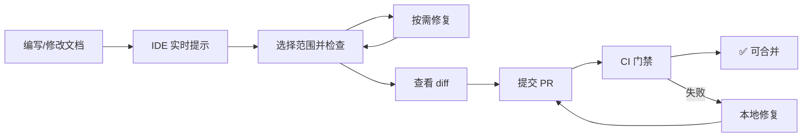

# RuyiSDK 文档规范检查方案

- **版本：** v1.0
- **适用项目：** RuyiSDK 文档（docs 仓库）
- **目标读者：** 开发者、PR Reviewer

## 目录

1. [概述](#1-概述)
2. [本地开发环境配置](#2-本地开发环境配置)
3. [配置文件详解](#3-配置文件详解)
4. [本地使用方式](#4-本地使用方式)
5. [完整工作流总结](#5-完整工作流总结)
6. [PR CI 门禁](#6-pr-ci-门禁)
7. [常见问题与故障排查](#7-常见问题与故障排查)
8. [配套文件清单](#8-配套文件清单)

## 1. 概述

本方案基于 `markdownlint-cli2` 工具链，为 RuyiSDK 文档提供从本地开发到 PR 合并的全流程质量保障。

### 1.1 整体架构

| 层次 | 工具 | 触发时机 | 目标 |
| --- | ---- | -------- | --- |
| **本地检查** | `markdownlint-cli2`（命令行/IDE 插件） | 编写文档时 | 即时发现格式问题 |
| **本地修复** | `markdownlint-cli2 --fix` | 提交前 | 自动修复可修复的问题 |
| **CI 门禁** | `markdownlint-cli2-action` (GitHub Actions) | PR 创建/更新时 | 阻断不合规 PR 合并 |

### 1.2 与写作规范的对应关系

本方案是 [《RuyiSDK 文档写作规范》](./DOCUMENTATION_STYLEGUIDE.zh.md) 的技术落地。规范中定义的每一项格式要求，均在本方案中配置为对应的 lint 规则。贡献者应首先遵循写作规范，本方案提供自动化的检查和辅助。

## 2. 本地开发环境配置

### 2.1 安装 markdownlint-cli2

**全局安装（推荐）：**

```bash
npm install -g markdownlint-cli2
```

**项目本地安装（备选）：**

```bash
npm install --save-dev markdownlint-cli2
```

### 2.2 VS Code 集成（推荐）

1. 安装扩展：`DavidAnson.vscode-markdownlint`
2. 安装后即可在编辑器中实时看到 lint 警告（波浪线标记），无需额外配置。

### 2.3 JetBrains IDE 集成（备选）

1. 安装全局 `markdownlint-cli2`（见 2.1）
2. 配置 External Tool：
   - Name: `MarkdownLint`
   - Program: `markdownlint-cli2`
   - Arguments: `--no-globs --fix "$FilePath$"`
3. 可通过 Tools → External Tools 菜单运行，或配置快捷键触发。

### 2.4 配置 npm scripts

如需使用 npm scripts，可在 `package.json` 中添加以下脚本，默认使用配置中的扫描范围；也可在运行时通过 `--no-globs` 指定其他范围：

```json
{
  "scripts": {
    "lint:md": "markdownlint-cli2",
    "lint:md:fix": "markdownlint-cli2 --fix"
  }
}
```

使用方式（`<target>` 为占位符，请替换为实际文件路径、目录路径或 glob 匹配模式，不保留尖括号）：

```bash
npm run lint:md -- --no-globs "<target>"        # 检查
npm run lint:md:fix -- --no-globs "<target>"    # 检查并自动修复

# 全量检查
npm run lint:md
# 目录检查
npm run lint:md -- --no-globs "Package-Manager/"
# 单文件检查
npm run lint:md -- --no-globs "Package-Manager/index.md"
```

直接传目录会递归检查目录中的文件，不限于 `.md` 和 `.mdx`。如需限定文件类型，可使用 `npm run lint:md -- --no-globs "Package-Manager/**/*.{md,mdx}"`。

## 3. 配置文件详解

### 3.1 `.markdownlint-cli2.yaml`

在项目根目录创建 `.markdownlint-cli2.yaml` 配置文件，用于控制 lint 规则和行为。

完整配置文件请直接查看仓库源文件：[`.markdownlint-cli2.yaml`](./.markdownlint-cli2.yaml)

> **说明**：
>
> - 配置文件中包含详细的注释说明，每条规则均标注了对应的规范章节。查看源文件即可了解规则用途和配置意图。
> - 当配置发生变更时，变更理由应在以下至少一处体现：配置文件注释、commit message、PR 描述。这有助于后续维护者理解变更背景，形成可追溯的决策记录。
> - 建议参考此配置模板，自行调整后维护到仓库中。

### 3.2 规则裁剪原则

以下规则被关闭的原因：

| 规则 | 关闭原因 |
| ---- | ------- |
| `MD013`（行长度） | 文档链接和代码示例常超长，强行限制不现实 |
| `MD033`（内联 HTML） | Docusaurus 需要 `<details>`、`<Tabs>` 等组件 |
| `MD034`（裸 URL） | 部分场景需要直接展示 URL |
| `MD041`（首行标题） | 文档以 Front Matter 开头，而非一级标题 |
| `MD053`（未使用引用） | 链接定义可能跨文件引用，无法准确判断 |

`MD060` 的 `aligned_delimiter` 选项禁用原因：

> 表格分隔行（`---`）与表头行管道符对齐检查虽然有利于源码可读性，但手动修复时需要对整张表格的每行进行管道符位置调整，操作繁琐且容易出错。因此仅在规范中保留"建议对齐"的文字说明，不做自动化检查。

## 4. 本地使用方式

以下命令均在 `ruyisdk/docs` 仓库根目录执行，文件路径不需要添加 `docs/` 前缀。可以按需选择全量、目录或单文件检查。

下文的 `<file-path>`、`<directory>` 和 `<target>` 均为占位符，请分别替换为实际文件路径、目录路径或检查范围（文件路径、目录路径或 glob 匹配模式），不保留尖括号。glob 使用双引号包裹，交由工具展开。

不带参数的 `markdownlint-cli2` 使用配置中的默认 `globs`，递归检查仓库内的 `.md` 和 `.mdx` 文件。配置中的 `globs` 会追加到命令行参数；仅检查指定范围时，应添加 `--no-globs`，忽略默认扫描范围，其他规则和忽略配置仍然生效。

### 4.1 检查所有文档

```bash
# 全局安装方式
markdownlint-cli2

# 项目本地安装方式
npx markdownlint-cli2
```

以上命令递归检查仓库内的 Markdown 和 MDX 文件，并遵循配置中的忽略规则。

### 4.2 检查并自动修复

使用 `--no-globs` 指定检查范围，并添加 `--fix`，可自动修复支持的问题。修复后应查看 `git diff`，确认修改符合预期。

```bash
markdownlint-cli2 --no-globs --fix "<target>"

# 示例：修复指定文件
markdownlint-cli2 --no-globs --fix "Package-Manager/index.md"
```

**`--fix` 可修复的常见问题：**

| 问题类型 | 说明 |
| ------- | ---- |
| 标题前后空行 | 自动为标题前后补充空行 |
| 代码块前后空行 | 自动为代码块前后补充空行 |
| 列表缩进 | 统一为 2 空格缩进 |
| 列表符号 | 统一为 `-` |
| 行尾空格 | 删除行尾多余空格 |
| 文件末尾换行 | 补充文件末尾换行 |

### 4.3 检查指定文件或目录

```bash
# 单文件检查
markdownlint-cli2 --no-globs "<file-path>"
# 示例
markdownlint-cli2 --no-globs "Package-Manager/index.md"

# 目录检查（包含子目录）
markdownlint-cli2 --no-globs "<directory>"
# 示例
markdownlint-cli2 --no-globs "Package-Manager/"

# 仅检查目录中的 Markdown 和 MDX 文件
markdownlint-cli2 --no-globs "<directory>/**/*.{md,mdx}"
# 示例
markdownlint-cli2 --no-globs "Package-Manager/**/*.{md,mdx}"
```

直接传目录不会按扩展名筛选文件，也可能包含 JSON 等非 Markdown 文件。仅需检查 `.md` 文件时，可使用 `"<directory>/**/*.md"`。

### 4.4 建议提交前执行

根据需要选择全量、目录或单文件检查范围，并将下列命令中的 `<target>` 替换为相应路径或 glob：

```bash
# 1. 检查所选范围
markdownlint-cli2 --no-globs "<target>"

# 2. 按需自动修复可修复的问题
markdownlint-cli2 --no-globs --fix "<target>"

# 3. 手动处理剩余问题后，重新检查
markdownlint-cli2 --no-globs "<target>"

# 4. 查看修改，确认符合预期后提交
git diff
```

## 5. 完整工作流总结

建议文档贡献者按照以下工作流进行本地检查和格式验证：



**关键节点说明：**

| 节点 | 执行方式 | 说明 |
| ---- | ------- | ---- |
| **IDE 实时提示** | VS Code 扩展自动完成 | 编写时即时发现格式问题 |
| **本地检查** | `npm run lint:md -- --no-globs "<target>"` | 按需选择全量、目录或单文件检查 |
| **自动修复** | `npm run lint:md:fix -- --no-globs "<target>"` | 按需修复所选范围，修复后查看 diff |
| **PR 自动检查** | CI 门禁自动触发 | 确保合并前所有格式合规 |

## 6. PR CI 门禁

### 6.1 GitHub Actions 工作流

CI 门禁通过 GitHub Actions 实现，工作流配置文件位于仓库的 `.github/workflows/markdown-lint.yml`。

- 完整配置请查看源文件：[`.github/workflows/markdown-lint.yml`](./.github/workflows/markdown-lint.yml)

> **说明**：当前 CI 门禁仅在 `restructure-zh` 分支上生效，其他分支暂不启用。如需在其他分支启用，请参考源文件中的分支配置。

### 6.2 门禁效果

| 状态 | 结果 |
| ---- | ---- |
| **检查通过** | ✅ PR 可正常合并 |
| **检查失败** | ❌ PR 被标记为 "Check Failure"，阻止合并 |

**检查失败时的处理流程：**

1. 查看 CI 日志，定位具体文件及问题行号
2. 本地执行 `markdownlint-cli2 --no-globs --fix "<file-path>"` 自动修复（将占位符替换为报错文件的实际路径）
3. 如无法自动修复，根据错误提示手动修改
4. 本地再次检查通过后 `git push` 更新 PR

## 7. 常见问题与故障排查

| 问题 | 原因 | 解决方法 |
| ---- | ----- | ------ |
| `markdownlint-cli2: command not found` | 未全局安装 | 全局安装：`npm install -g markdownlint-cli2` |
| 扫描到 0 个文件 | 配置或命令行中的路径未匹配到文件，或文件被忽略 | 检查扫描范围和忽略规则，并确认相对于当前工作目录的路径正确，参见第 4 节 |
| VS Code 扩展不生效 | 未安装扩展或未重启 VS Code | 安装 `DavidAnson.vscode-markdownlint` 并重启 |
| `--fix` 无法修复的问题 | 问题涉及内容语义判断 | 根据错误提示手动修改 |
| CI 检查失败但本地检查通过 | 配置文件未同步 | 确保 `.markdownlint-cli2.yaml` 已提交 |
| 中文表格检查误报 | `MD060` 对中文宽度判断不准 | 已关闭 `aligned_delimiter`，仅保留 `style: "compact"` |
| CI 超时 | 文档数量过多 | 联系仓库维护者切换到增量检查模式 |

## 8. 配套文件清单

| 文件 | 位置 | 用途 |
| ---- | ---- | ---- |
| `.markdownlint-cli2.yaml` | 项目根目录 | Lint 规则配置 |
| `.github/workflows/markdown-lint.yml` | `.github/workflows/` | CI 门禁工作流 |
| `package.json`（scripts 部分） | 项目根目录 | 本地命令封装 |

---

本方案随项目演进持续更新。修订请提交 PR 并在描述中说明变更动机。
