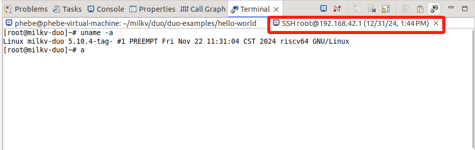
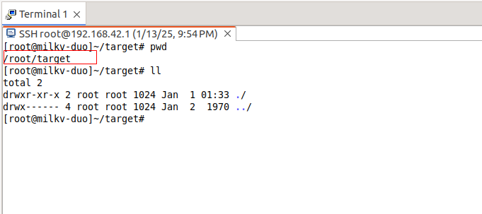
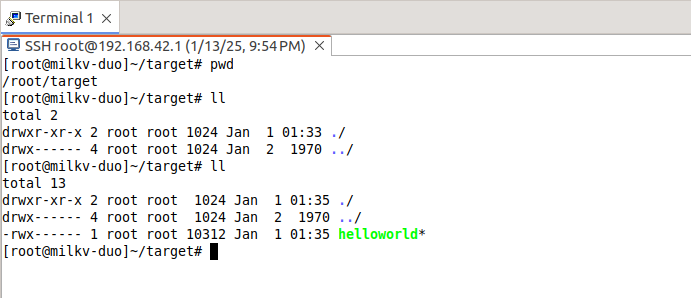
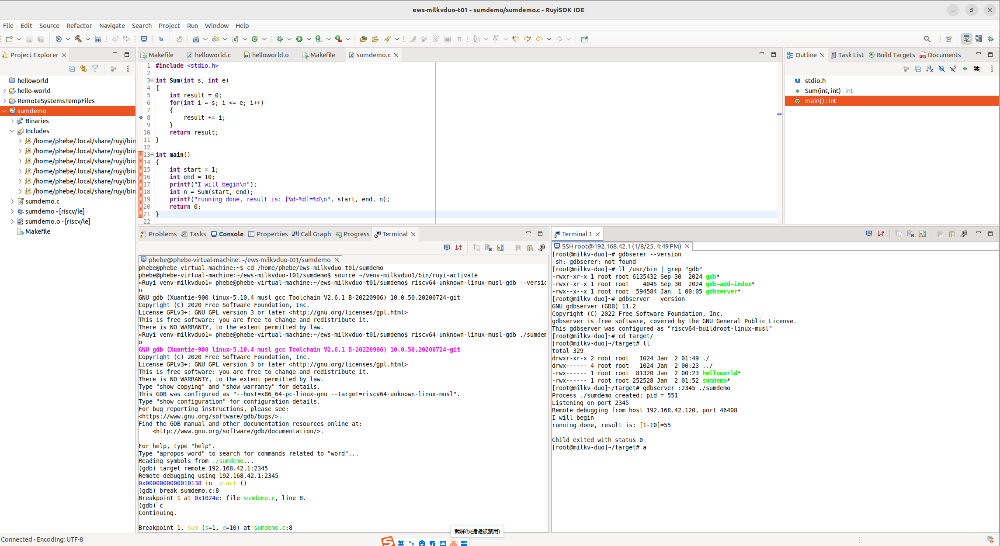
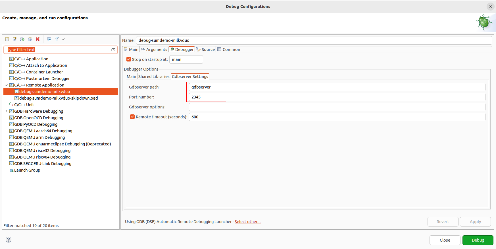

# Milkv Duo ：使用 riscv64-unknown-linux-musl-bin 工具链编译、运行、调试

## 编译环境搭建

1. 安装 RuyiSDK 包管理器 [参考](/docs/Package-Manager/installation)
2. 安装编译工具链，本文以 `gnu-milkv-milkv-duo-musl` 编译器举例（您可以根据需要修改工具链及版本）：

   ```bash input="2,5"
   # 查看软件源的资源
   $ ruyi list --name-contains milkv --category-is toolchain

   # 安装指定的工具链
   $ ruyi install gnu-milkv-milkv-duo-musl-bin

   # 从返回信息中可以查看安装的路径，如 ~/.local/share/ruyi/binaries/x86_64/gnu-milkv-milkv-duo-musl-bin-0.20240731.0+git.67688c7335e7
   ```
3. 创建和使用Duo编译环境

   ```bash input="2,5"
   # 查看ruyi预配置环境
   $ ruyi list profiles

   # 创建一个虚拟环境：工具链为gnu-milkv-milkv-duo-musl-bin
   $ ruyi venv -t gnu-milkv-milkv-duo-musl-bin milkv-duo ./venv-milkvduo
   ```

## 在IDE中开发

### 源码准备

本文以 milkv-duo 开发板的应用示例 duo-examples 为例。使用下面任一方式获取源码：

   ```bash input="2,5"
   # 方法一：git clone
   $ git clone https://github.com/milkv-duo/duo-examples.git

   # 方法二：ruyi extract 命令下载
   $ ruyi extract milkv-duo-examples
   ```

### 导入并设置工程属性

1. File > New > Project

   
2. 选择 C/C++ > Makefile Project with Existing Code > Next

   
3. 导入准备好的源码：

   - 点击 Browse >  目标源码路径
   - Toolchain for Indexer Settings ：选择 RISC-V Cross GCC
   - Finish

     
4. 工程 hello-world > 右键 > Properties  配置相关属性

   1. 为工程配置工具链路径

      

      选择之前ruyi install 安装编译器的路径（默认在~/.local/share/ruyi/binaries/x86_64/ 路径下），或者创建的虚拟环境下的bin目录；
   2. 设置编译属性

      
5. 编辑 Makefile

   - 项目自带的 Makefile 的正确运行依赖于 envsetup.sh 脚本对环境变量的预先设置。之前在[厂商文档操作实践](https://github.com/milkv-duo/duo-examples/blob/main/README-zh.md)中，我们了解到预先设置了编译器前缀、编译选项、链接参数等信息，为了方便，将这些信息写到 Makefile 中指定。注意 TOOLCHAIN_PREFIX 路径需要按需修改。
   - 编译参数：

     - -mcpu=c906fdv ：指定交叉编译时目标 CPU 的型号
     - -march=rv64imafdcv0p7xthead ：指定交叉编译时目标架构
     - -g ：生成调试信息
   - 为了实现从构建到目标程序的自动拷贝到目标设备，Makefile中还增加了upload目标（这是建立在PC和目标设备完成SSH认证的前提下，请参考文末“SSH秘钥配置”），同时还需要预先在目标设备上建好相关的目录（存放路径自定义，但请修改scp命令后的路径确保和实际环境一致）。
   - 您还可以在下面 Makefile 的基础上继续修改，本文只是提供一种参考。

     ```makefile
     # Eclipse 工具链设置
     #TOOLCHAIN_PREFIX := ~/milkv/duo/duo-examples/host-tools/gcc/riscv64-linux-musl-x86_64/bin/riscv64-unknown-linux-musl-
     TOOLCHAIN_PREFIX := ~/.local/share/ruyi/binaries/x86_64/gnu-milkv-milkv-duo-musl-bin-0.20240731.0+git.67688c7335e7/bin/riscv64-unknown-linux-musl-

     CFLAGS := -mcpu=c906fdv -march=rv64imafdcv0p7xthead -g
     LDFLAGS := 

     TARGET = helloworld

     CC = $(TOOLCHAIN_PREFIX)gcc

     SOURCE = $(wildcard *.c)
     OBJS = $(patsubst %.c,%.o,$(SOURCE))

     all: $(TARGET)

     $(TARGET): $(OBJS)
        $(CC) $(CFLAGS) -o $@ $(OBJS) $(LDFLAGS)

     %.o: %.c
        $(CC) $(CFLAGS) -o $@ -c $<

     upload: $(TARGET)
        scp $(TARGET) root@192.168.42.1:/root/target/$(TARGET)

     clean:
        rm -f *.o $(TARGET)

     .PHONY: all clean upload
     ```
6. 在IDE中打开 Terminal 视窗，创建一个 SSH Terminal，方便在IDE中登录目标设备并进行相关操作。如果需要，同时也可以再创建一个 Local Terminal 窗口配合使用。这个根据个人习惯自行选择。具体操作：

   - Window > Show View > Terminal
   - Terminal: Open a new Terminal View/Open a Terminal > SSH Terminal > 对照下图输入Host、User、Password（milkvduo的root密码是：milkv）

     

     

     

     
   - 使用 Makefile 中的 `scp` 命令前，需要在目标主机上提前创建好对应的目录结构，这样文件能够正确被传输到目标目录。构建完成后，目录下将会出现目标程序。

     

### 执行构建

准备好上述配置和修改之后，右键工程，点 “Build Project”，构建成功则：

1. Console 窗口无错误

   
2. SSH Terminal窗口已经能够看到成功传输的helloworld目标程序

   

### 将目标程序传输到目标设备

- 如果 Makefile 中定义了 upload 目标，则在上面 "Build Project" 时，已经完成了目标程序的传输。
- 如果 Makefile 中未定义 upload 目标，则可以手动执行 `scp helloworld root@192.168.42.1:/root/target/` 命令完成目标程序的传输。

### 运行目标程序并回显执行结果

在IDE中有多种方式可以支持运行目标程序，可以按照习惯和需求选择。这里列举了一些我尝试通过的方式，更多方式欢迎一起探索。

#### SSH Terminal

可以在 SSH Terminal 窗口中查看 helloworld 目标程序，并运行：

   

#### C/C++ Remote Application

操作：右键项目 > Run As  > Run Configurations  >  C/C++ Remote Application

对照下面的图（图是Debug模式下截图，由于配置是一样的，借Debug的图说明配置要点），参考着配置相关参数，重点如下：

- Project：默认，即target程序名
- C/C++ Application : 也默认是target程序名（Search Project查询指定）
- Connect：New >  SSH
- Remote Absolute File Path for C/C++ Application : 输入在RISC-V设备上目标程序的绝对地址（本例中需要与Makefile upload的scp命令中的路径一致）
- Skip download to target path：当前版本这里建议勾选，并搭配在Makefile中定义upload目标来实现目标程序从主机传输到目标开发板上。这是因为不勾选的情况下，需要IDE安装RSE（Remote System Explorer）插件，并且要求目标设备系统支持 sftp-server。目前 milkvduo 上不支持 sftp-server，所以暂时不支持该功能。

  

  

运行效果展示：

- 
- 

  > milkv duo img 目前不支持sftp：https://github.com/milkv-duo/duo-buildroot-sdk/issues/167  当milvduo镜像支持 sftp-server 后该问题能够解决。
  >

### 调试

#### 准备调试示例

helloworld的示例调试效果不佳，为了体现调试、打断点、单步跟踪等功能，这里换了另一个示例。

**sumdemo.c**

```c
#include <stdio.h>

int Sum(int s, int e)
{
   int result = 0;
   for(int i = s; i <= e; i++)
   {
      result += i;
   }
   return result;
}


int main()
{
   int start = 1;
   int end = 10;
   printf("I will begin\n");
   int n = Sum(start, end);
   printf("running done, result is: [%d-%d]=%d\n", start, end, n);
   return 0;
}


```

**Makefile：**

```makefile
# 工具链前缀
TOOLCHAIN_PREFIX := ~/.local/share/ruyi/binaries/x86_64/gnu-milkv-milkv-duo-musl-bin-0.20240731.0+git.67688c7335e7/bin/riscv64-unknown-linux-musl-

# 编译选项
CFLAGS := -mcpu=c906fdv -march=rv64imafdcv0p7xthead -g
LDFLAGS := 

# 目标文件名
TARGET = sumdemo

# 编译器
CC = $(TOOLCHAIN_PREFIX)gcc

# 源文件与目标文件
SOURCE = $(wildcard *.c)
OBJS = $(patsubst %.c,%.o,$(SOURCE))

# 默认目标
all: $(TARGET)

$(TARGET): $(OBJS)
	$(CC) $(CFLAGS) -o $@ $(OBJS) $(LDFLAGS)

%.o: %.c
	$(CC) $(CFLAGS) -o $@ -c $<

# 上传目标
upload: $(TARGET)
	scp $(TARGET) root@192.168.42.1:/root/target/$(TARGET)

# 清理
clean:
	rm -f *.o $(TARGET)

.PHONY: all clean upload
```

#### 准备gdbserver

原厂 buildroot 镜像不自带 gdbsever，可拷贝原厂gdbserver可执行文件或使用 RuyiSDK 添加 gdbsever 后重新构建的镜像。

1. 下载原厂gdbserver可执行程序：https://github.com/milkv-duo/duo-buildroot-sdk/blob/develop/ramdisk/rootfs/public/gdbserver/riscv_musl/usr/bin/gdbserver
2. 将上述下载的gdbserver拷贝到milkv duo设备的path路径下：

   ```bash input="1-2"
   $ scp gdbserver root@192.168.42.1:/usr/bin/
   $ ssh root@192.168.42.1 "chmod +x /usr/bin/gdbserver"
   ```

#### Terminal中调试

这种操作跟使用操作系统的Terminal调试无差别，习惯使用命令的可以尝试。

Terminal支持 Local Terminal 和 SSH Terminal等多种方式，可以同时开一个Local Terminal 和 一个 SSH Terminal 连到milkv duo上，进行操作。

GDBServer + GDB命令远程调试的步骤如下：

1. milkvduo设备端（helloworld所在目录下操作）:

   ```bash input="1"
   [root@milkv-duo]~/target# gdbserver :2345 ./sumdemo
   Process ./sumdemo created; pid = 1802
   Listening on port 2345
   ```
2. PC端（helloworld.c所在目录下操作）：

   ```bash input="1,5-7"
   $ cd ~/ews-milkvduo-t01/sumdemo

   # 查看gdb版本，启动调试
   # 这里使用 ruyi 虚拟环境进行调试，激活虚拟环境，在虚拟环境下编译
   $ source ~/venv-milkvduo/bin/ruyi-activate
   $ riscv64-unknown-linux-musl-gdb --version
   $ riscv64-unknown-linux-musl-gdb ./sumdemo

   $ target remote 192.168.42.1:2345   #端口号需要跟gdbserver端一致

   $ break sumdemo.c:8                 #在第8行设置断点

   # 下面几个可能常用，请按需灵活使用
   $ c                                 #contuinu，继续程序的运行,直到遇到下一个断点
   $ disp result                       #跟踪查看某个变量,每次停下来都显示它的值
   $ print result                      #打印内部变量result

   ```

   

   

#### C/C++ Remote Application

对照下面的图，参考着配置相关参数，重点如下：

- Project：默认，即 target 程序名
- C/C++ Application : 也默认是target程序名（Search Project查询指定）
- Connect：New >  SSH
- Remote Absolute File Path for C/C++ Application : 输入在RISC-V设备上目标程序的绝对地址（本例中需要与Makefile upload的scp命令中的路径一致）
- Skip download to target path：当前版本这里建议勾选，并搭配在Makefile中定义upload目标来实现目标程序从主机传输到目标开发板上。这是因为不勾选的情况下，需要IDE安装RSE（Remote System Explorer）插件，并且要求目标设备系统支持 sftp-server。目前 milkvduo 上不支持 sftp-server，所以暂时不支持该功能。
- Debugger > Main > GDB Debugger : 指定GDB的路径。本例中使用的是 `~/.local/share/ruyi/binaries/x86_64/gnu-milkv-milkv-duo-musl-bin-0.20240731.0+git.67688c7335e7/bin/riscv64-unknown-linux-musl-gdb`
- Debugger > GDB > GDBserver setting: 指定GDBServer 及通信端口

  

  

  

  

  跟运行一样，由于目前 milkv duo 不支持 sftp-server，因此目标程序的远端传输功能不可用，执行会报如下的错误。

  

  勾选 Skip download to target path 跳过下载目标程序，就能绕过这个问题。配合Makefile中的upload定义，在构建阶段就完成目标程序从主机传输到目标设备中。

  

运行效果展示：

- 
- 

## 补充说明

### SSH秘钥配置

这里详细说明下 SSH 秘钥配置：

通过为 host 和 milkv duo 配置 ssh-key 免密登录，从而实现构建后自动将二进制文件连接并传输到milkv duo的指定路径下。

    1. 在 host上执行`ssh-keygen`

    2. 将公钥添加到milkv duo上：

```bash input="1"
$ cat ~/.ssh/xxxx.pub | ssh root@192.168.42.1 'mkdir -p ~/.ssh && cat >> ~/.ssh/authorized_keys'
```

    3. 验证：`ssh root@192.168.42.1`

    成功的情况下此时不需要再输入密码了。
