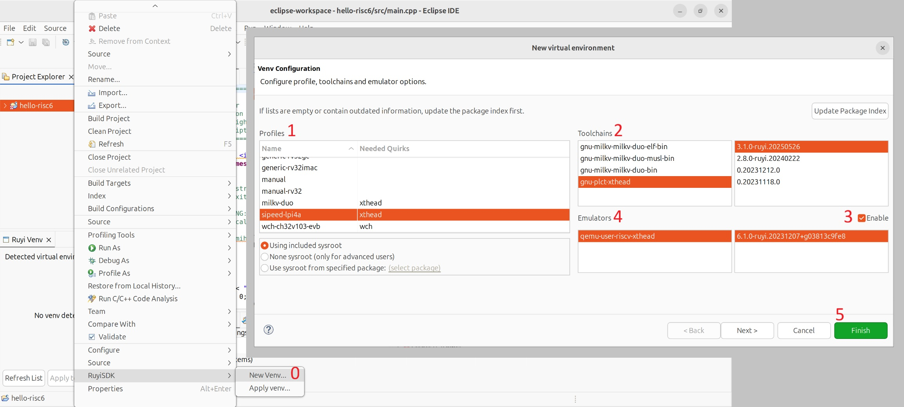
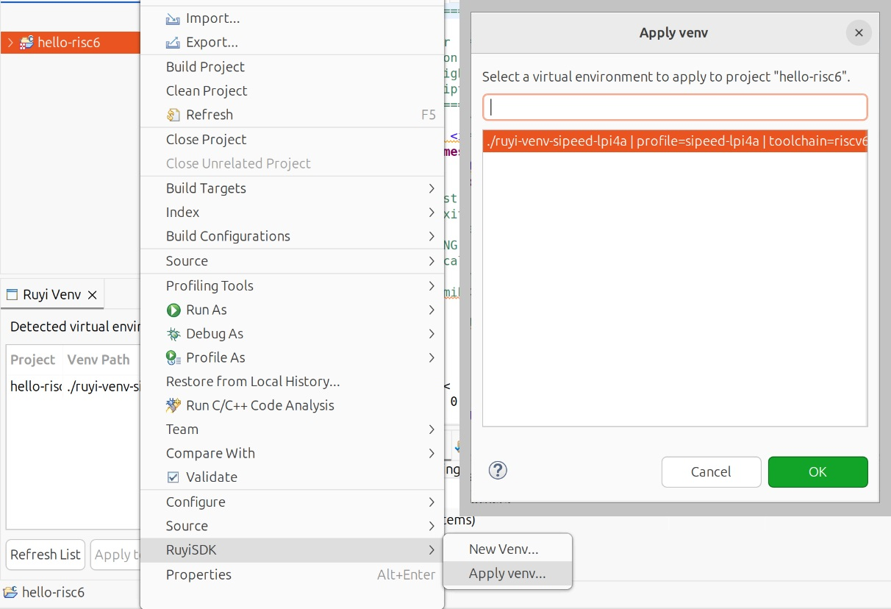
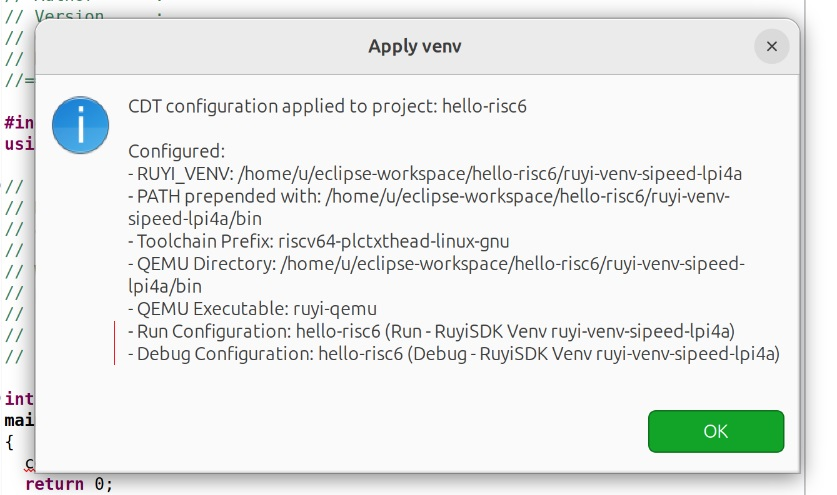
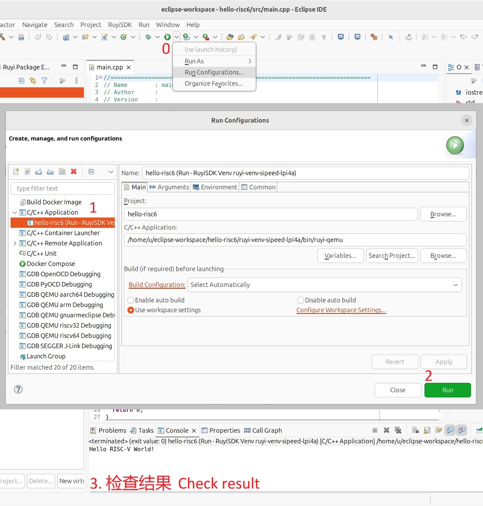
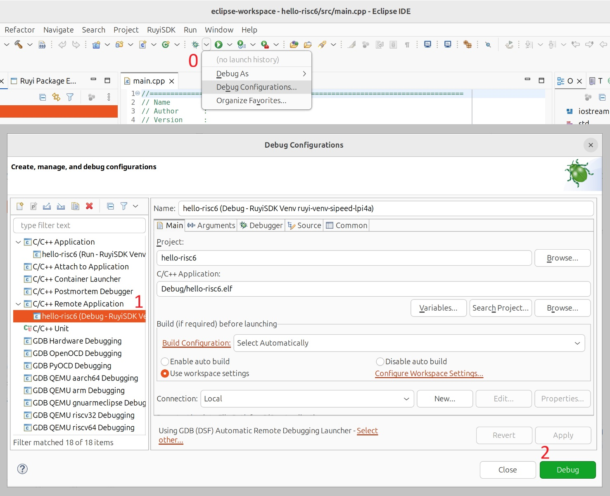
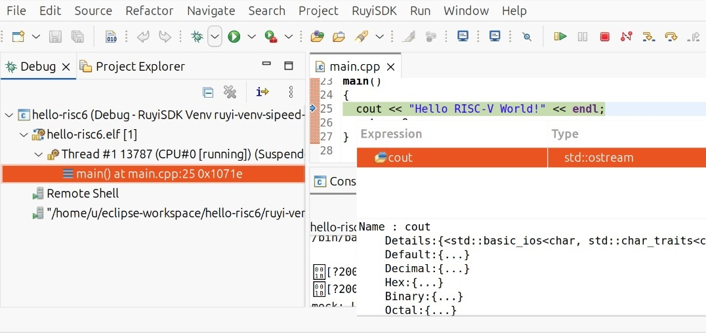

# Sipeed Lichee Pi 4A: 在 RuyiSDK IDE 中构建并调试 Hello World 项目

## 测试环境

- 操作系统: Ubuntu 24.04 x86_64
- IDE: Eclipse IDE for Embedded C/C++ Developers 2026-06 (4.40.0)

## 使用 IDE 安装 Ruyi 包管理器

启动 IDE，展开顶部菜单栏的 "RuyiSDK"，单击 "Ruyi Installation" 打开 Ruyi 安装向导，按照指引操作。完成安装后展开菜单栏的 "File"，单击 "Restart" 重启 IDE 。

## 在 IDE 中创建 C/C++ 项目

启动 IDE，依次展开顶部菜单栏的 "File" - "New"，在 "C/C++ Project" 窗口中单击 "Classic C++ Project" 向导。

在 "New Classic C++ Project" 页面的 "Project type" 中选择 "Executable" - "Hello World RISC-V C++ Project"，"Toolchains" 选择 "RISC-V Cross GCC"。

清空 "Basic Settings" 页面中提供的链接器参数 "Linker other options"。

在 "GNU RISC-V Cross Toolchain" 页面不需要做任何配置，直接单击 "Finish"。

此时不需要构建该项目。

## 为新项目创建虚拟环境

在 "Project Explorer" 中右键单击刚才的项目，在 "RuyiSDK" 中单击 "New Venv..." 打开 "New virtual environment" 窗口。在 "Profiles" 中选择 "sipeed-lpi4a"；在 "Toolchains" 中选择最新的 "gnu-plct-xthead"；勾选 "Emulators" 右侧的 "Enable" 并选择最新的 "qemu-user-riscv-xthead"。完成各项选择后，单击 "Finish" 并等待创建完毕。

## 应用虚拟环境并构建项目

在 "Project Explorer" 中右键单击刚才的项目，在 "RuyiSDK" 中单击 "Apply Venv..." 打开 "Apply venv" 窗口。在列表中选择一个虚拟环境并单击 "OK"。

请留意提示框中包含的 Run 与 Debug 启动配置的名称。

在 "Project Explorer" 中右键单击刚才的项目，单击 "Build Project"。

项目构建成功，生成文件名以 ".elf" 结尾的可执行程序。

## 使用 QEMU 运行或调试构建出的程序

### 运行

在 IDE 顶部工具栏中找到绿色播放按钮，单击其右侧的向下箭头，再单击 "Run Configurations..." 打开 "Run Configurations" 窗口。在左侧列表中展开 "C/C++ Application"，找到与刚才的项目和虚拟环境关联的条目。单击 "Run" 运行构建出的程序。

程序执行成功。

### 调试

在 IDE 顶部工具栏中找到绿色昆虫按钮，单击其右侧的向下箭头，再单击 "Debug Configurations..." 打开 "Debug Configurations" 窗口。在左侧列表中展开 "C/C++ Remote Application"，找到与刚才的项目和虚拟环境关联的条目。单击 "Debug" 调试构建出的程序。

可见线程、栈帧和数据类型等信息。
