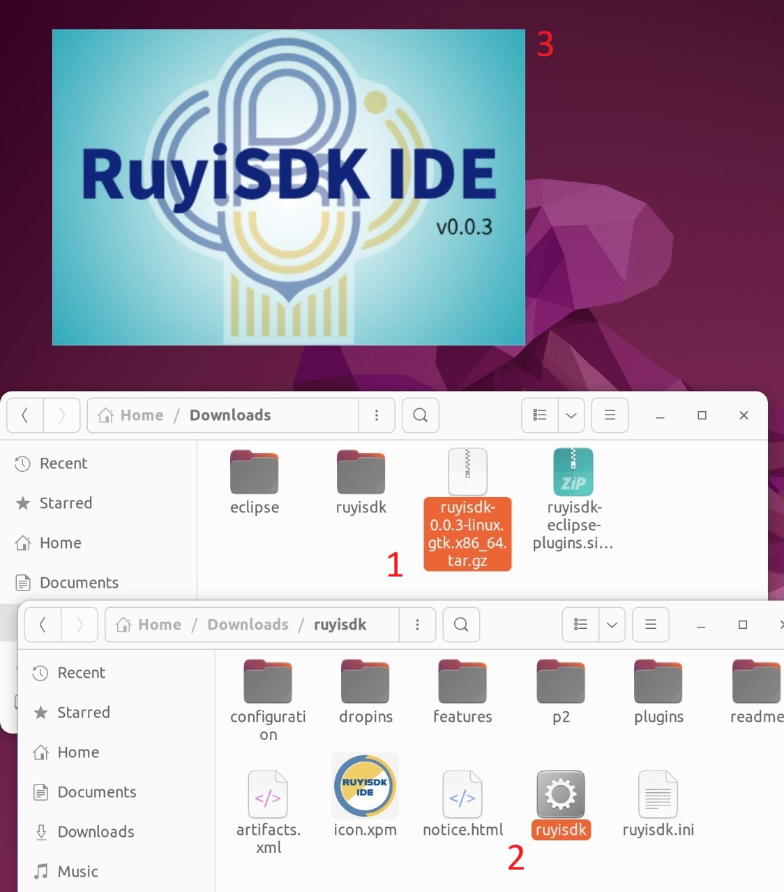
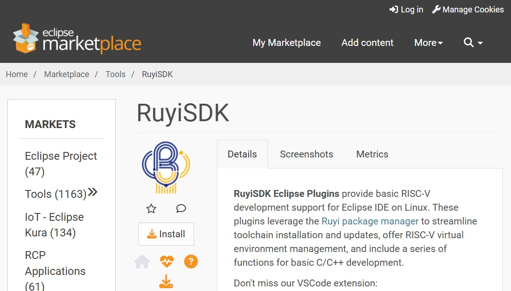

# 概览

## 简介

RuyiSDK IDE 是一款基于开源软件 Eclipse Embedded CDT 开发的图形化、主要面向 RISC-V 开发者的集成开发环境。该工具继承了 Eclipse 对嵌入式开发的良好支持，计划逐步集成多款主流 RISC-V 开发板的 SDK，建成有 RuyiSDK 特色的 RISC-V 开发环境，造福软件开发者。

## 下载

RuyiSDK IDE 下载地址：https://fast-mirror.isrc.ac.cn/ruyisdk/ide/0.0.3/ (请勿去掉末尾的斜杠)

本 IDE 支持 x86_64、aarch64、riscv64 三种架构，请按照您当前的开发环境选择；IDE 中已包含 JRE，您无需额外配置 Java 环境。

## 启动

1. 将 tar.gz 包解压缩，在释放出的 ruyisdk 文件夹中双击 `ruyisdk` 以启动 IDE。

2. 选择一个文件夹作为 IDE 的工作空间 (Workspace)。如果是首次使用，您可以选择一个新文件夹；如果您要继续之前的开发，请填入已存在的工作空间的路径。

3. 完成工作空间的选择后，单击 `Launch` 按钮就可以进入 IDE 了。

## 安装插件

为了使用完整的 RuyiSDK 环境，您需要安装 RuyiSDK IDE 插件。请访问 Eclipse Marketplace 安装插件: https://marketplace.eclipse.org/content/ruyisdk

目前我们正在完善集成插件的 RuyiSDK IDE 工程，将很快提供更加便捷的安装方式。

## 案例

- [Sipeed Lichee Pi 4A: 在 RuyiSDK IDE 中构建 Hello World 项目](./cases/sipeed-lpi4a-ide-hello-world.md)

RuyiSDK IDE 的文档均以 Ubuntu 22.04 LTS x86_64 为例展开说明，如果您在使用其他版本 Ubuntu 或使用其他发行版时遇到问题，欢迎您到 [RISC-V 开发者社区](https://ruyisdk.cn/)或我们的[代码仓库](https://github.com/ruyisdk/ruyisdk-eclipse-plugins/issues)提交截图和报错信息。感谢您为 RISC-V 生态添砖加瓦！

## 更新

RuyiSDK IDE 在不断迭代。启动新版本 IDE 或更新 RuyiSDK 插件后，您可以放心选择已有的工作空间 (Workspace) 以继续开发。我们的文档将不断更新，建议您始终使用最新版本的 RuyiSDK IDE 以解决 bug 并获得新功能。
