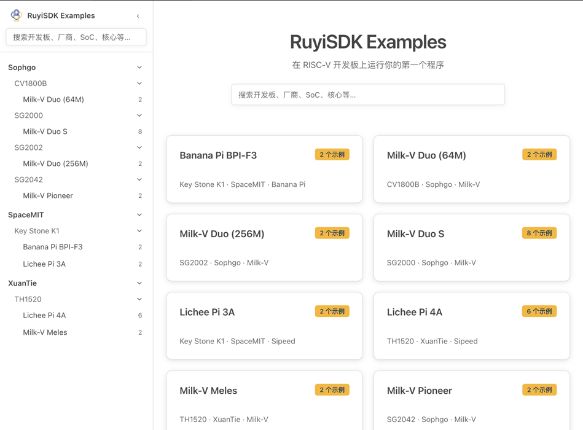
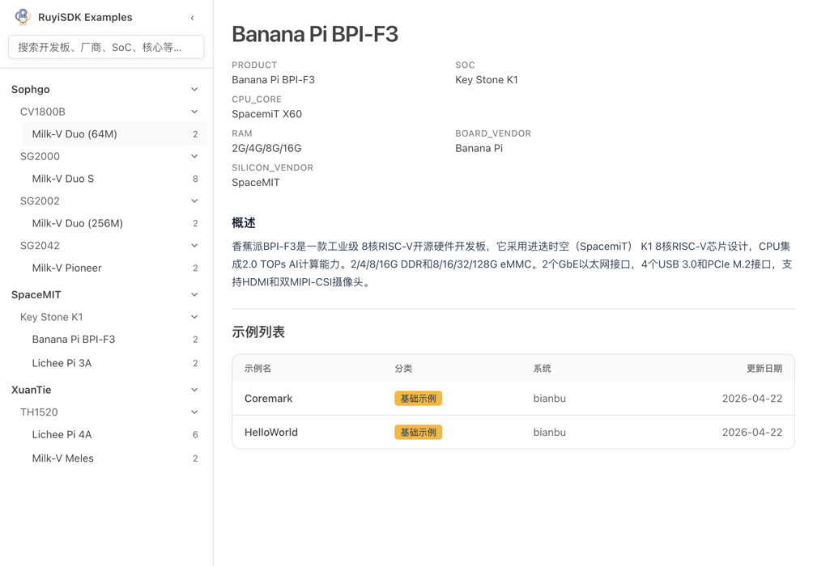
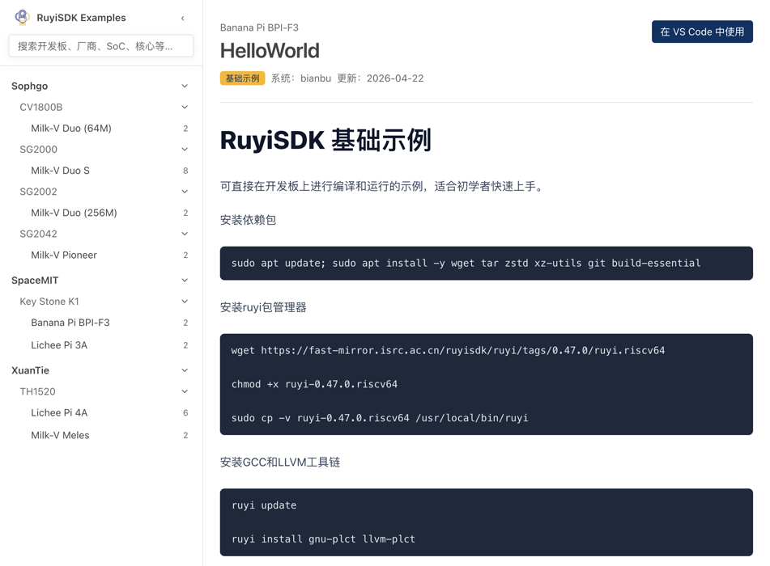

# RuyiSDK 示例 (RuyiSDK Examples / Board Docs)

本文面向初次接触到 RISC-V / RuyiSDK 或想要快速测试开发板的用户，介绍如何利用 RuyiSDK 示例功能，
阅读各种 RISC-V 开发板的环境初始化指南、示例、多媒体、人工智能和其他教程文档，并在 Copilot 中打开它们以便于进行自动化操作。

## 1. 如何打开 RuyiSDK 示例

目前，有两个入口可以打开 RuyiSDK 示例：

- 在 VSCode 命令面板输入 `ruyi.board-docs`
- 在扩展首页打开 RuyiSDK 示例

注意，使用该功能依赖于有效的互联网连接。

## 2. 如何使用 RuyiSDK 示例

在示例首页中，按照品牌和型号选择你所需要的开发板。你将看到该开发板基本情况的描述，和可用的示例列表。

点击示例列表中的示例即可查看一则示例文档。示例文档将会介绍如何在该型号的 RISC-V 开发板上运行示例，或进行其他开发操作，
如多媒体处理、人工智能训练和推理。

点击右上角的蓝色 “在 VSCode 中打开”，将会自动将文档和相关 Prompt 填充到 Copilot 聊天框中，便于使用 Copilot 自动化操作。
