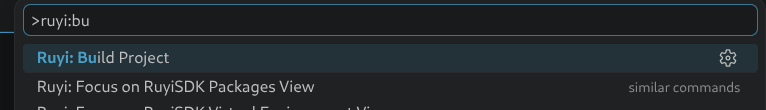
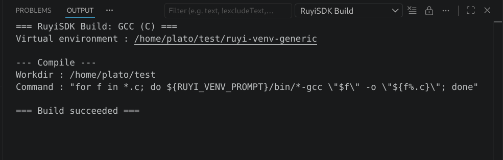

# 构建（Build RuyiSDK Package）

本文面向日常使用扩展进行工程构建的用户，介绍如何一键构建、如何结合虚拟环境（venv）工作、以及如何自定义构建规则。

## 1. 构建系统能做什么

RuyiSDK 扩展内置了一个“自动识别 + 一键执行”的构建系统：

- 自动识别当前工作区的构建类型
- 按规则顺序执行构建步骤
- 在激活 Ruyi venv 时，在该环境中启动构建命令
- 在输出面板集中展示完整日志

默认支持以下构建类型（按优先级从高到低）：

1. CMake（通过 `CMakeLists.txt` 识别）
2. GNU Make（通过 `Makefile` / `GNUmakefile` / `makefile` 识别）
3. GCC C 项目（通过工作区根目录下的 `*.c` 识别）


## 2. 从哪里触发构建

你可以通过以下入口触发构建：

- 状态栏左下角 `Build` 按钮

  

- 编辑器标题栏按钮（`Build Project`）

  

- 命令面板执行 `Ruyi: Build Project`

  


建议首次使用时先打开一个包含项目根目录的工作区，再点击 `Build`。

## 3. 使用流程

1. 安装并配置好 RuyiSDK
2. （可选）在 `RuyiSDK Virtual Environment` 视图中激活一个 venv
3. 打开需要构建的工程根目录
4. 点击 `Build` 按钮
5. 查看通知与 `RuyiSDK Build` 输出面板日志

构建成功后会显示 `Build succeeded` 通知；失败时会提示失败步骤和退出码。


## 4. 自动识别规则说明

扩展会在工作区根目录检测构建系统，并按优先级选择第一条命中规则：

- `CMakeLists.txt` -> CMake
- `Makefile` / `GNUmakefile` / `makefile` -> GNU Make
- `*.c`（工作区根目录）-> GCC C

如果都未命中，会提示当前工作区没有可识别的构建系统。

提示：当同时存在多种标志文件（例如既有 `CMakeLists.txt` 又有 `Makefile`）时，会优先使用 CMake 规则。

## 5. venv 对构建的影响

当有激活的 Ruyi venv 时：

- 构建步骤会在该 venv 环境中执行
- 可使用 venv 中可直接访问的编译器和环境变量
- 状态栏 Build 按钮的提示信息会显示当前 venv 名称

对于带有现成编译系统的项目（例如 `CMakeLists.txt`、`Makefile`）：

- 一键编译只会在当前激活的 venv 中启动对应构建命令
- 需要开发者自行套用虚拟环境里的工具链（例如 CMake 项目通常需要开发者自行指定 `CMAKE_TOOLCHAIN_FILE`、Preset 或相关缓存项；Makefile 项目通常需要自行设置 `CC`、`CXX` 或其他工具链变量。）
- 一键编译功能不会帮助开发者自动把该工具链注入到项目配置中

当没有激活 venv 时：

- 构建将使用系统环境中的工具（例如系统 `cmake`、`gcc`、`make`）

## 6. 输出日志

每次构建会输出到 `RuyiSDK Build` 面板，包含：

- 命中的构建系统
- 当前是否使用 venv
- 每一步的工作目录（Workdir）
- 每一步的执行命令（Command）
- 失败步骤、退出码和错误输出

建议在失败时优先查看该输出面板，而不是仅看通知弹窗。



## 7. 自定义构建规则（高级）

如果默认规则不满足你的项目，可以在工作区根目录创建：

- `.ruyi-build-rules.json`

注意：

- 该文件会**整体替换**扩展内置规则（不是增量合并）

### 7.1 规则文件结构

顶层结构：

- `version`: 规则版本字符串
- `description`: 可选描述
- `rules`: 规则列表

每条规则包含：

- `id`: 规则唯一标识
- `name`: 展示名称
- `priority`: 优先级（数字越大越先匹配）
- `indicators`: 根目录精确文件名列表
- `indicatorGlobs`: 可选，glob 匹配列表
- `steps`: 构建步骤列表

每个步骤包含：

- `name`: 步骤名
- `command`: 要执行的命令
- `args`: 参数数组
- `workdir`: 可选，相对工作区根目录
- `useShell`: 可选，是否通过 shell 执行

### 7.2 示例：自定义一个最简单 Make 规则

```json
{
  "version": "1",
  "description": "Workspace custom build rules",
  "rules": [
    {
      "id": "my-make",
      "name": "My GNU Make",
      "priority": 50,
      "indicators": ["Makefile"],
      "steps": [
        {
          "name": "Build",
          "command": "make",
          "args": ["-j4"],
          "workdir": "."
        }
      ]
    }
  ]
}
```

### 7.3 关于 `useShell`

- `useShell: true` 时，命令会交给 shell 执行，适合通配符、管道、循环等场景
- 在激活 venv 的情况下，可以在 shell 命令里使用 venv 相关变量（例如默认规则中的 `${RUYI_VENV_PROMPT}`）
- `useShell: true` 下请注意手动做好参数引用，避免空格和特殊字符导致解析问题

示例：批量编译工作区根目录下的所有 `*.c` 文件

下面这个例子使用了 shell 的 `for` 循环和通配符 `*.c`。这类写法如果不启用 `useShell: true`，就不会按 shell 语义展开执行。

```json
{
  "version": "1",
  "description": "Build all C files with shell loop",
  "rules": [
    {
      "id": "c-shell-loop",
      "name": "GCC C with Shell Loop",
      "priority": 20,
      "indicators": [],
      "indicatorGlobs": ["*.c"],
      "steps": [
        {
          "name": "Compile All",
          "command": "for f in *.c; do gcc \"$f\" -O2 -Wall -o \"${f%.c}\"; done",
          "args": [],
          "workdir": ".",
          "useShell": true
        }
      ]
    }
  ]
}
```
