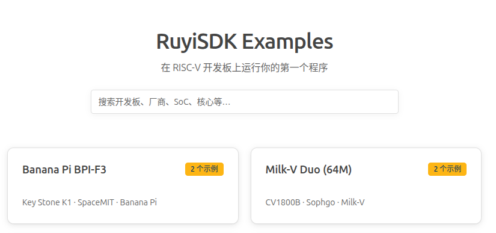
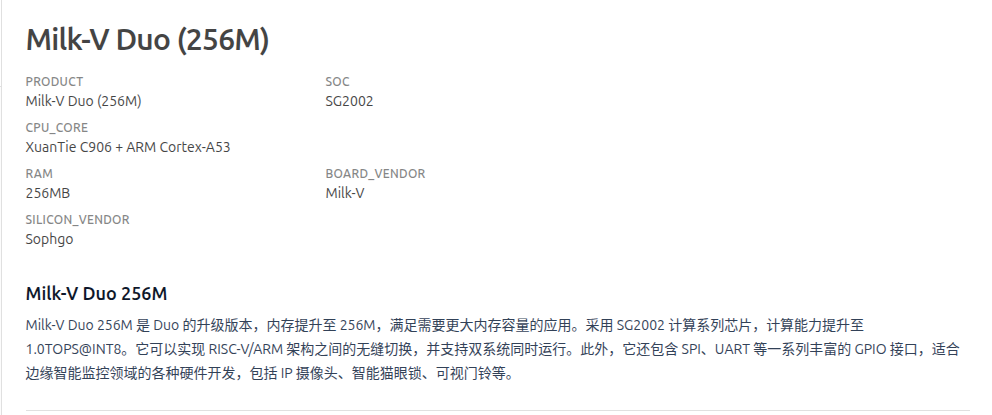
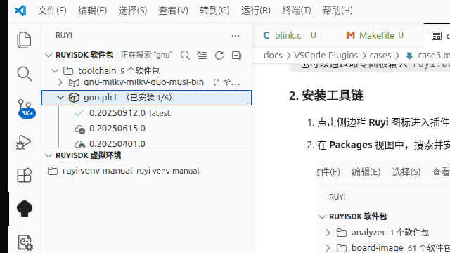
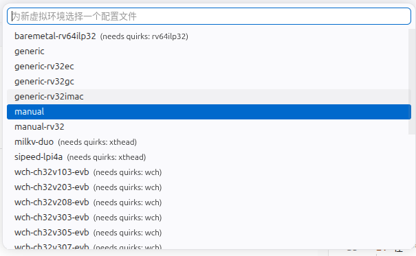
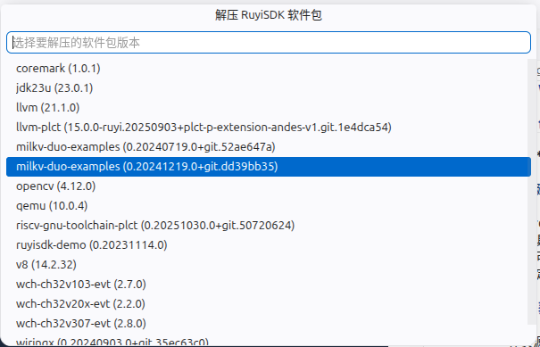
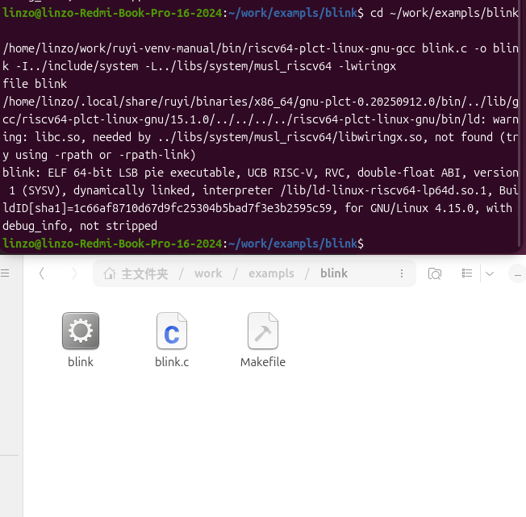

# Milk-V Duo (256M) LED Blink：使用 RuyiSDK 示例完成外设开发

本示例演示如何利用插件中的 **RuyiSDK 示例** 功能，找到 Milk-V Duo (256M) 开发板的 LED Blink 示例，并通过插件的包管理、虚拟环境和源码解包能力，完成从查找示例到板载 LED 闪烁的完整开发流程。

## 前置条件

- 已安装 RuyiSDK VSCode 扩展（如未安装，可在 VSCode 扩展市场搜索 RuyiSDK 安装）
- 已连接互联网（RuyiSDK 示例功能需要网络）
- 已准备 Milk-V Duo (256M) 开发板，并已完成系统启动（参考 [Milk-V Duo 官方文档](https://milkv.io/zh/docs/duo/getting-started/boot)）
- 开发板与主机在同一网络下（开发板默认 IP 为 `192.168.42.1`）

## 步骤

### 1. 通过 RuyiSDK 示例查找 LED Blink 示例

1. 打开 VS Code，按下 `Ctrl+Shift+P` 打开命令面板，输入 `ruyi home`，选择 **Ruyi: Open Home** 进入插件首页。
2. 在首页中点击 **RuyiSDK Examples** 卡片的 **Open RuyiSDK Examples** 按钮，打开示例面板。

   

3. 在示例首页的板卡列表中，找到 **Milk-V Duo (256M)**（标注 SG2002 · Sophgo · Milk-V），点击进入该开发板的示例列表。

   
4. 在示例列表中点击 **Blink**，阅读 LED 闪烁示例的详细文档。

> 也可以通过命令面板输入 `ruyi.board-docs` 直接打开 RuyiSDK 示例面板。

### 2. 安装工具链

1. 点击侧边栏 **Ruyi** 图标进入插件主页。
2. 在 **Packages** 视图中，搜索并安装 `gnu-plct` 工具链。

   

### 3. 创建虚拟环境

1. 在 **Virtual Environments** 视图点击 `+` 创建虚拟环境：

   

   - Profile 选择 `manual`（手动模式）。
   - 工具链选择已安装的 `gnu-plct`。
   - （可选）选择模拟器。
   - 指定名称与路径，创建并点击名称激活。

### 4. 获取源码

1. 在资源管理器中右键当前工作目录，选择 **Extract RuyiSDK Package**。
2. 在弹出的包列表中搜索并选择 `milkv-duo-examples`，将其解包到当前目录。

   

### 5. 编译 LED 闪烁程序

1. 打开 VS Code 终端，在 **Virtual Environments** 视图中点击已创建的虚拟环境名称进行激活（激活后终端 PATH 会自动包含工具链路径），进入 `blink` 子目录：

   ```bash
   cd blink
   ```

2. 使用虚拟环境中的工具链编译：

   ```bash
   riscv64-plct-linux-gnu-gcc blink.c -o blink \
       -I../include/system \
       -L../libs/system/musl_riscv64 \
       -lwiringx
   ```

   或通过项目自带 Makefile 编译（需传入环境变量）：

   ```bash
   make TOOLCHAIN_PREFIX=riscv64-plct-linux-gnu- \
        CFLAGS="-I../include/system" \
        LDFLAGS="-L../libs/system/musl_riscv64 -lwiringx"
   ```

3. 验证生成的二进制文件：

   ```bash
   file blink
   ```

   

### 6. 传输并运行

1. 将编译好的程序传输到开发板：

   ```bash
   scp blink root@192.168.42.1:/root/
   ```

2. SSH 登录开发板（默认用户名 `root`，默认密码 `milkv`）：

   ```bash
   ssh root@192.168.42.1
   ```

3. 禁用系统自带的 LED 闪烁脚本（避免冲突）：

   ```bash
   mv /mnt/system/blink.sh /mnt/system/blink.sh_backup && sync
   reboot
   ```

4. 重启后重新 SSH 登录，运行程序：

   ```bash
   ssh root@192.168.42.1
   ./blink
   ```

5. 正常情况下，终端持续输出 LED 状态，板载蓝色 LED 同步闪烁：

   ```
   Duo LED GPIO (wiringX) 25: High
   Duo LED GPIO (wiringX) 25: Low
   Duo LED GPIO (wiringX) 25: High
   Duo LED GPIO (wiringX) 25: Low
   ...
   ```

6. 按 `Ctrl+C` 可终止程序。

### 7. 恢复系统原有 LED 功能

测试完成后，恢复系统默认 LED 闪烁：

```bash
ssh root@192.168.42.1
mv /mnt/system/blink.sh_backup /mnt/system/blink.sh && sync
reboot
```

## 备注

- 本示例中使用的 Milk-V Duo (256M) 搭载 SG2002 芯片，与 Milk-V Duo (64M)（搭载 CV1800B 芯片）为不同型号，请注意区分。
- 若需在 RuyiSDK 示例面板中使用 Copilot 辅助操作，可点击示例文档右上角的蓝色 **在 VSCode 中打开** 按钮，文档内容将自动填充到 Copilot 聊天框中。
- 如需在本机模拟运行（无实体开发板），请在创建虚拟环境时选择合适的 QEMU 模拟器，并在终端中运行。
