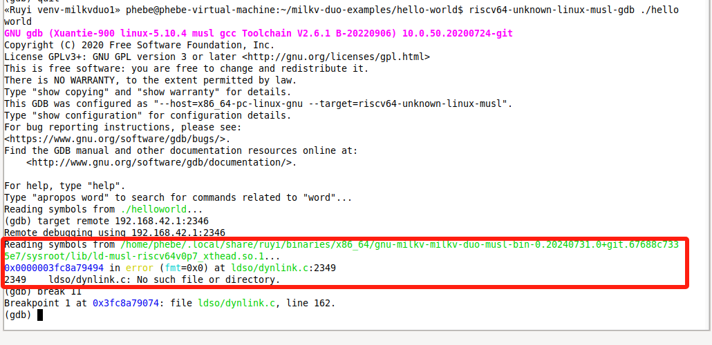
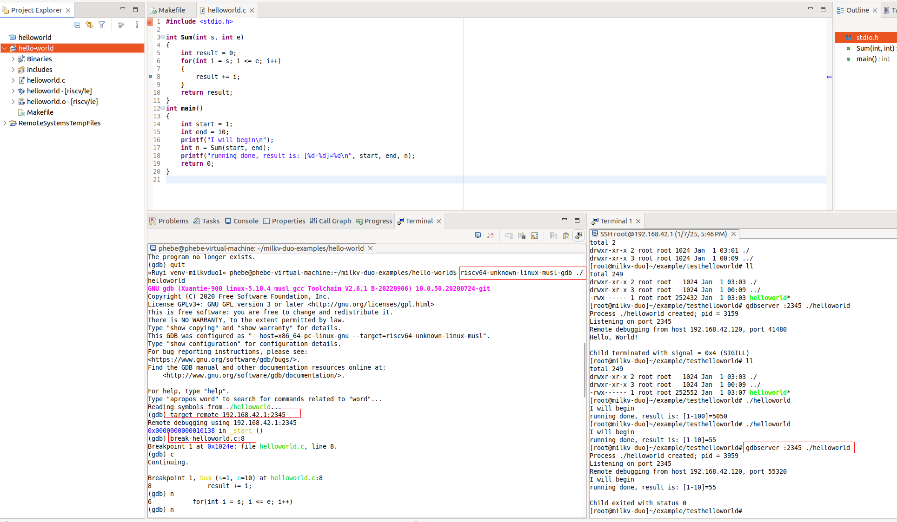

## 使用 ruyi 为 milkv duo 安装镜像、编译器等开发环境

### PC上安装 ruyi

1. 可从RuyiSDK仓库下载最新版本 [https://mirror.iscas.ac.cn/ruyisdk/ruyi/releases/](https://gitee.com/link?target=https%3A%2F%2Fmirror.iscas.ac.cn%2Fruyisdk%2Fruyi%2Freleases%2F)

   ```
   wget https://mirror.iscas.ac.cn/ruyisdk/ruyi/releases/0.24.0/ruyi.amd64  #从软件源下载ruyi本体
   chmod +x ruyi.amd64  #给ruyi添加执行权限
   sudo cp ruyi.amd64 /usr/local/bin/ruyi #将ruyi本体改名为ruyi，并放入PATH
   ruyi version 
   ruyi update  #更新软件包索引
   ```

### 安装编译器，编译

2. 安装 gnu-milkv-milkv-duo-musl 编译器

   ```
   #查看软件源的资源
   #ruyi list

   #安装指定的工具链
   ruyi install gnu-milkv-milkv-duo-bin
   #从返回信息中可以查看安装的路径，如 ~/.local/share/ruyi/binaries/x86_64/gnu-milkv-milkv-duo-bin-0.20240731.0+git.67688c7335e7
   ```
3. 创建和使用Duo编译环境

   ```
   #查看ruyi预配置环境
   #ruyi list profiles

   #创建一个虚拟环境（自定义命名milkv-venv）：工具链为gnu-milkv-milkv-duo-musl-bin
   #ruyi venv -t gnu-milkv-milkv-duo-musl-bin milkv-duo ./venv-milkvduo
   ruyi venv -t gnu-milkv-milkv-duo-musl-bin generic ./venv-milkvduo-generic

   #激活虚拟环境
   source venv-milkvduo-generic/bin/ruyi-activate
   ```
4. 下载 duo-example 源码并使用 gnu-milkv-milkv-duo-musl 工具链进行交叉编译

   > 当 ruyisdk 还未集成并提供开发板对应的 example 时，可自己下载或者导入想要编译的源码。
   >

   ```
   #下载duo-example
   mkdir milkv-duo-examples 
   cd milkv-duo-examples
   ruyi extract milkv-duo-examples   #资源名可通过ruyi list查询
   ```
5. 编译源码

   ```
   cd hello-world
   ls -al

   #执行编译
   riscv64-unknown-linux-musl-gcc -g -o helloworld helloworld.c  

   riscv64-unknown-linux-musl-gcc -march=rv64imafdcv0p7xthead -mabi=lp64d -O3 -g -o helloworld helloworld.c  

   riscv64-unknown-linux-musl-gcc -mcpu=c906fdv -march=rv64imafdcv0p7xthead -mcmodel=medany -mabi=lp64d -O3 -DNDEBUG -g -o helloworld helloworld.c  -D_LARGEFILE_SOURCE -D_LARGEFILE64_SOURCE -D_FILE_OFFSET_BITS=64

   # venv-milkvduo-generic虚拟环境下，上述3个命令都能编译成功。但是venv-milkvduo下，会报错：https://github.com/ruyisdk/ruyi/issues/255

   #查看
   ls -al
   file helloworld
   #helloworld: ELF 64-bit LSB executable, UCB RISC-V, RVC, double-float ABI, version 1 (SYSV), dynamically linked, interpreter /lib/ld-musl-riscv64v0p7_xthead.so.1, with debug_info, not stripped

   #退出虚拟环境
   ruyi-deactivate 
   ```

   至此，编译就完成了。目前生成了RISC-V目标程序。在当前PC端是无法运行的，需要拷贝到 milkv duo 开发板上运行。

   接下来就再介绍如何使用ruyisdk系统安装工具给 RISC-V 设备安装镜像，并运行上述的目标程序。

### 运行目标程序

#### RV设备端：烧录镜像

1. 【建议，但非必须，可以避免烧录过程出问题】格式化SD卡，准备烧录镜像

   ```bash
   #准备：sd卡插入读卡器，读卡器插入PC。先格式化并删除已有的分区
   #查看sd卡设备节点（我环境下一般是/dev/sdb）
   sudo df -h

   #umount：（按实际情况修改设备节点）
   sudo umount /dev/sdb1
   sudo umount /dev/sdb2

   # 删除sd卡所有分区（/dev/sdb1 和 /dev/sdb2）
   sudo wipefs --all /dev/sdb

   #格式化：
   sudo mkfs.ext4 /dev/sdb
   ```
2. 烧录系统到sd卡

   ```bash
   #烧录镜像
   ruyi device peovision
   #后续按照提示一步步执行，选择 milkv duo 设备对应的相关参数和选项，按照提示执行即可。

   # 烧录完成后，请将sd卡插入到 milkv duo sd卡卡槽中，将 milkv duo 设备通过 usb-typec 线通电，通电后将自动启动，启动成功后执行如下操作连接 milkv duo 设备进行远程操作
   ssh root@192.168.42.1  
   root 密码: milkv
   ```

#### 执行目标程序

1. PC：执行scp拷贝命令将目标程序传输到目标设备

   ```
   $ scp helloworld root@192.168.42.1:/root/
   ```
2. 执行目标程序
   发送成功后，在 ssh 或者串口登陆的终端中运行 `./helloworld`，会打印 `Hello, World!`

   ```bash
   #连接远程设备
   ssh root@192.168.42.1
   root 密码: milkv

   [root@milkv]~# ./helloworld
   Hello, World!
   ```

### gdbserver远程调试

参考：https://gitee.com/yunxiangluo/milkv-duo/blob/master/README.md#5-%E7%A8%8B%E5%BA%8F%E8%B0%83%E8%AF%95

#### 准备gdbserver

原厂buildroot镜像不自带gdbsever，可拷贝原厂gdbserver可执行文件或使用RuyiSDK添加gdbsever后重新构建的镜像。

1. 下载原厂gdbserver可执行程序：https://github.com/milkv-duo/duo-buildroot-sdk/blob/develop/ramdisk/rootfs/public/gdbserver/riscv_musl/usr/bin/gdbserver
2. 将上述下载的gdbserver拷贝到milkv duo设备的path路径下：

   ```bash
   scp gdbserver root@192.168.42.1:/usr/bin/
   ssh root@192.168.42.1 "chmod +x /usr/bin/gdbserver"
   ```
3. 准备一个方便打断点和单步跟踪的例子 (我命名为sum.c)

   ```c
   #include <stdio.h>

   int Sum(int s, int e)
   {
       int result = 0;
       for(int i = s; i <= e; i++)
       {
           result += i;
       }
       return result;
   }
   int main()
   {
       int start = 1;
       int end = 10;
       printf("I will begin\n");
       int n = Sum(start, end);
       printf("running done, result is: [%d-%d]=%d\n", start, end, n);
       return 0;
   }

   ```
4. 按照前面的章节进行编译构建得到目标程序

   - 方法1：eclipse IDE，工程右键 > Build project
   - 方法2：命令行执行 make
   - 方法3：gcc命令

     - ~/milkv/duo/duo-examples/host-tools/gcc/riscv64-linux-musl-x86_64/bin/riscv64-unknown-linux-musl-gcc -mcpu=c906fdv -march=rv64imafdcv0p7xthead -O3  -g -o helloworld helloworld.c   #调试的时候报错，找不到库（待进一步确认）
       
     - ~/milkv/duo/duo-examples/host-tools/gcc/riscv64-linux-musl-x86_64/bin/riscv64-unknown-linux-musl-gcc -g -o helloworld helloworld.c   -static   #静态链接，调试顺利
5. 调试

   使用 gdbserver 进行调试，详细补充见下面章节。

#### 调试步骤

1. milkvduo设备端（helloworld所在目录下操作）:

   ```
   [root@milkv-duo]~/example/testhelloworld# gdbserver :2345 ./helloworld
   Process ./helloworld created; pid = 1802
   Listening on port 2345
   ```
2. PC端（helloworld.c所在目录下操作）：

   ```
   cd ~/milkv-duo-examples/hello-world

   #查看gdb版本，启动调试
   #~/milkv/duo/duo-examples/host-tools/gcc/riscv64-linux-musl-x86_64/bin/riscv64-unknown-linux-musl-gdb --version
   #~/milkv/duo/duo-examples/host-tools/gcc/riscv64-linux-musl-x86_64/bin/riscv64-unknown-linux-musl-gdb ./helloworld

   #这里尽量使用ruyi已经提供的功能，基于之前创建的虚拟环境，激活虚拟环境，在虚拟环境下编译（感觉好处就是不用设置环境变量，gcc也不用指定绝对路径
   source ~/venv-milkvduo/bin/ruyi-activate 
   riscv64-unknown-linux-musl-gdb --version
   riscv64-unknown-linux-musl-gdb ./helloworld

   target remote 192.168.42.1:2345   #端口号需要跟gdbserver端一致

   break helloworld.c:8              #在第8行设置断点

   #下面几个可能常用，请按需灵活使用
   c                                 #contuinu，继续程序的运行,直到遇到下一个断点
   n                                 #执行下一条语句,如果该语句为函数调用,不会进入函数内部执行(即不会一步步地调试函数内部语句)
   print result                      #打印内部变量result
   disp result                       #跟踪查看某个变量,每次停下来都显示它的值
   ```



GDB更详细的使用方法可参考GDB帮助。

| 命令           | 命令缩写 |          | 命令说明                                                                                 |
| -------------- | -------- | -------- | ---------------------------------------------------------------------------------------- |
| list           | l        |          | 显示多行源代码                                                                           |
| break          | b        |          | 设置断点,程序运行到断点的位置会停下来                                                    |
| info           | i        |          | 描述程序的状态                                                                           |
| run            | r        | 不能用？ | 开始运行程序                                                                             |
| display        | disp     |          | 跟踪查看某个变量,每次停下来都显示它的值                                                  |
| step           | s        |          | 执行下一条语句,如果该语句为函数调用,则进入函数执行其中的第一条语句                       |
| next           | n        |          | 执行下一条语句,如果该语句为函数调用,不会进入函数内部执行(即不会一步步地调试函数内部语句) |
| print          | p        |          | 打印内部变量值                                                                           |
| continue       | c        |          | 继续程序的运行,直到遇到下一个断点                                                        |
| set var name=v |          |          | 设置变量的值                                                                             |
| start          | st       |          | 开始执行程序,在main函数的第一条语句前面停下来                                            |
| file           |          |          | 装入需要调试的程序                                                                       |
| kill           | k        |          | 终止正在调试的程序                                                                       |
| watch          |          |          | 监视变量值的变化                                                                         |
| backtrace      | bt       |          | 产看函数调用信息(堆栈)                                                                   |
| frame          | f        |          | 查看栈帧                                                                                 |
| quit           | q        |          | 退出GDB环境                                                                              |


## 使用QEMU模拟器
针对 gnu-milkv-milkv-duo-musl-bin ，暂无配套的qemu模拟器。

### 下载安装qemu

   ```
   #查询并安装qemu
   ruyi list | grep "qemu"
   ruyi install qemu-user-riscv-upstream
   #ruyi install qemu-system-riscv-upstream

   #创建带qemu的虚拟环境
   ruyi venv -t gnu-milkv-milkv-duo-musl-bin -e qemu-user-riscv-upstream  milkv-duo  venv-milkvduo-qemuuser
   source ~/venv-milkvduo-qemuuser/bin/ruyi-activate 

   ruyi-qemu ~/milkv-duo-examples/hello-world/helloworld
   ruyi-qemu ~/ews-milkvduo-t01/sumdemo/sumdemo
   qemu-riscv64: warning: disabling zfa extension because privilege spec version does not match

   ruyi-deactivate 

   ------------

   ruyi venv -t gnu-milkv-milkv-duo-musl-bin -e qemu-user-riscv-upstream  generic  venv-milkvduo-generic-qemuuser
   ruyi-qemu ~/milkv-duo-examples/hello-world/helloworld
   ruyi-qemu ~/ews-milkvduo-t01/sumdemo/sumdemo
   没有任何输出


   ruyi venv -t gnu-milkv-milkv-duo-musl-bin -e qemu-user-riscv-xthead  milkv-duo  venv-milkvduo-x
   qemu-riscv64: unable to find CPU model 'thead-c906'

   ---------换编译器
   ruyi venv -t gnu-upstream -e qemu-user-riscv-upstream  generic  venv-generic


   ```

### 模拟运行
#### 配置1
TOOLCHAIN_PREFIX := ~/.local/share/ruyi/binaries/x86_64/gnu-upstream-0.20231212.0/bin/riscv64-unknown-linux-gnu-
CFLAGS := -g -static
LDFLAGS :=  -D_FILE_OFFSET_BITS=64 

在RV设备上运行：
[root@milkv-duo]~/target# ./helloworld 
Hello, Welcome to the world of RuyiSDK!

在host上模拟运行：
«Ruyi venv-generic» phebe@phebe-virtual-machine:~/milkv-duo-examples/hello-world$ ruyi-qemu helloworld
Hello, Welcome to the world of RuyiSDK!

#### 配置2
TOOLCHAIN_PREFIX := ~/milkv/duo/duo-examples/host-tools/gcc/riscv64-linux-x86_64/bin/riscv64-unknown-linux-gnu-
CFLAGS := -g -static
LDFLAGS :=  -D_FILE_OFFSET_BITS=64 
在RV设备上运行：
[root@milkv-duo]~/target# ./helloworld 
Hello, Welcome to the world of RuyiSDK!

在host上模拟运行：
«Ruyi venv-generic» phebe@phebe-virtual-machine:~/milkv-duo-examples/hello-world$ ruyi-qemu helloworld
> 无任何输出，也无任何报错


#### 配置3
TOOLCHAIN_PREFIX := ~/milkv/duo/duo-examples/host-tools/gcc/riscv64-linux-musl-x86_64/bin/riscv64-unknown-linux-musl-
CFLAGS := -g -static
LDFLAGS :=  -D_FILE_OFFSET_BITS=64 

«Ruyi venv-milkvduo-qemuuser» phebe@phebe-virtual-machine:~/milkv-duo-examples/hello-world$ ruyi-qemu ./helloworld
qemu-riscv64: warning: disabling zfa extension because privilege spec version does not match
Hello, Welcome to the world of RuyiSDK!


#### 配置4
TOOLCHAIN_PREFIX := ~/milkv/duo/duo-examples/host-tools/gcc/riscv64-linux-musl-x86_64/bin/riscv64-unknown-linux-musl-
CFLAGS := -mcpu=c906fdv -march=rv64imafdcv0p7xthead -g -I/home/phebe/milkv/duo/duo-examples/include/system -static
LDFLAGS := -D_LARGEFILE_SOURCE -D_LARGEFILE64_SOURCE -D_FILE_OFFSET_BITS=64 -L/home/phebe/milkv/duo/duo-examples/libs/system/musl_riscv64

«Ruyi venv-milkvduo-qemuuser» phebe@phebe-virtual-machine:~/milkv-duo-examples/hello-world$ ruyi-qemu ./helloworld
qemu-riscv64: warning: disabling zfa extension because privilege spec version does not match

> 提示zfa，但是没有运行结果输出


