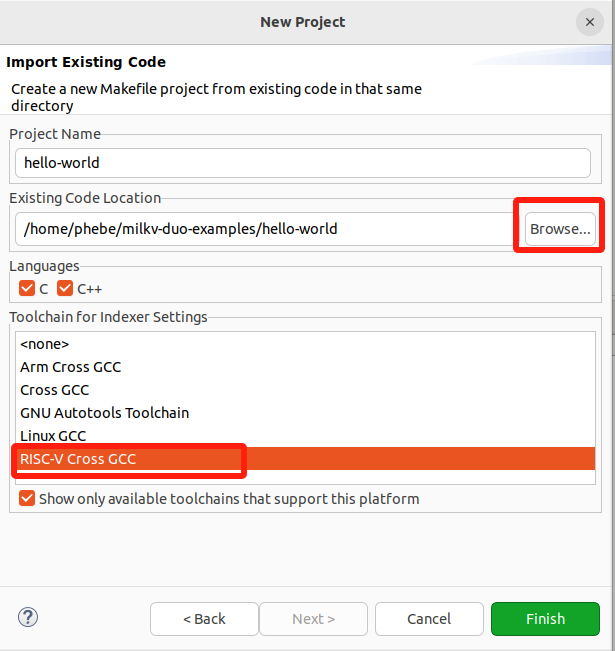
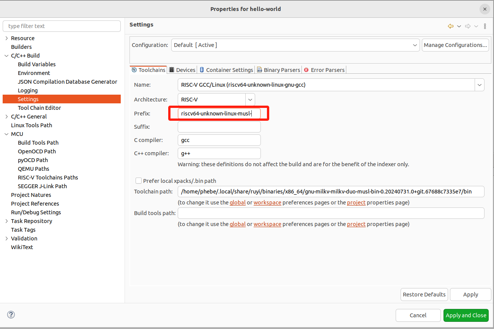
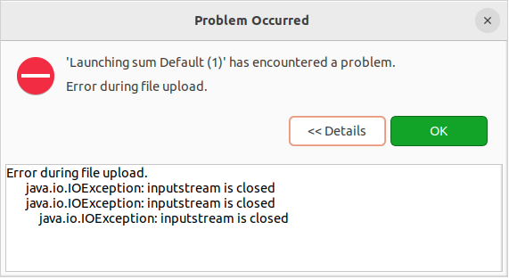

## 使用 RuyiSDK IDE 开发、编译、运行

### 下载 RuyiSDK IDE

下载地址：https://mirror.iscas.ac.cn/ruyisdk/ide

从上述下载地址下载最新版本的 ide ，注意需要选择匹配架构的安装包。

以本地环境为例，ubuntu 22.04 LTS ，x86_64，下载 https://mirror.iscas.ac.cn/ruyisdk/ide/0.0.1/ruyisdk-0.0.1-linux.gtk.x86_64.tar.gz 到本地任意路径并解压（RuyiSDK IDE 已经集成了openJDK供程序自身的运行，可以不用额外安装JDK）。

解压缩后直接双击 `ruyisdk` 文件即可启动运行 RuyiSDK IDE。也可以在命令行中执行 `./ruyisdk` 运行程序。

### 源码准备

本文以 milkv-duo 开发板的应用示例 duo-examples 为例。使用下面任一方式获取源码：

```
#方法一：git clone
git clone https://github.com/milkv-duo/duo-examples.git

#方法二：ruyi extract 命令下载
ruyi extract milkv-duo-examples
```

### 导入 hello-world 工程并编辑

1. File > New > Project

   
2. 选择 Makefile Project with Existing Code > Next

   
3. 导入准备好的源码：

   - 点击 Browse >  目标源码路径
   - Toolchain for Indexer Settings ：选择 RISC-V Cross GCC
   - Finish

   
4. 工程 hello-world > 右键 > Properties  配置相关属性

   1. 为工程配置工具链路径
      
      选择之前ruyi install 安装编译器的路径（默认在~/.local/share/ruyi/binaries/x86_64/ 路径下），或者创建的虚拟环境下的bin目录；
   2. 设置编译属性

      
5. 编辑 Makefile

   - 项目自带的 Makefile 的正确运行依赖于 envsetup.sh 脚本对环境变量的预先设置。之前在[厂商文档操作实践](1-milkv-sdk.md)中，我们了解到预先设置了编译器前缀、编译选项、链接参数等信息，为了方便，将这些信息写到 Makefile 中指定。注意 TOOLCHAIN_PREFIX 路径需要按需修改。
   - 为了实现从构建到目标程序的自动拷贝到目标设备，Makefile中还增加了upload目标（这是建立在PC和目标设备完成SSH认证的前提下），同时还需要预先在目标设备上建好相关的目录（路径不同请修改scp命令后的路径）
   - 你还可以在下面 Makefile 的基础上继续修改，本文只是提供一种参考。

   ```makefile
   # Eclipse 工具链设置
   #TOOLCHAIN_PREFIX := ~/milkv/duo/duo-examples/host-tools/gcc/riscv64-linux-musl-x86_64/bin/riscv64-unknown-linux-musl-
   TOOLCHAIN_PREFIX := ~//.local/share/ruyi/binaries/x86_64/gnu-milkv-milkv-duo-musl-bin-0.20240731.0+git.67688c7335e7/bin/riscv64-unknown-linux-musl-
   #CC := ~/milkv/duo/duo-examples/host-tools/gcc/riscv64-linux-musl-x86_64/bin/riscv64-unknown-linux-musl-gcc

   # 编译选项
   #CFLAGS := -mcpu=c906fdv -march=rv64imafdcv0p7xthead -mcmodel=medany -mabi=lp64d -g -DNDEBUG -I~/milkv/duo/duo-examples/include/system
   CFLAGS := -mcpu=c906fdv -march=rv64imafdcv0p7xthead -O3  -g -I~/milkv/duo/duo-examples/include/system 
   LDFLAGS := -D_LARGEFILE_SOURCE -D_LARGEFILE64_SOURCE -D_FILE_OFFSET_BITS=64 -L~/milkv/duo/duo-examples/libs/system/musl_riscv64

   TARGET=helloworld

   ifeq (,$(TOOLCHAIN_PREFIX))
   $(error TOOLCHAIN_PREFIX is not set)
   endif

   ifeq (,$(CFLAGS))
   $(error CFLAGS is not set)
   endif

   ifeq (,$(LDFLAGS))
   $(error LDFLAGS is not set)
   endif

   CC = $(TOOLCHAIN_PREFIX)gcc

   SOURCE = $(wildcard *.c)
   OBJS = $(patsubst %.c,%.o,$(SOURCE))

   # 默认目标
   all: $(TARGET)

   $(TARGET): $(OBJS)
   	$(CC) $(CFLAGS) -o $@ $(OBJS) $(LDFLAGS)

   %.o: %.c
   	$(CC) $(CFLAGS) -o $@ -c $<

   # 上传目标
   upload: $(TARGET)
   	scp $(TARGET) root@192.168.42.1:/root/example/testhelloworld/$(TARGET)

   .PHONY: clean upload
   clean:
   	rm -f *.o $(TARGET)
   #	@rm *.o -rf
   #	@rm $(OBJS) -rf
   #	@rm $(TARGET)

   # 让 'all' 目标依赖于 'upload'，以便在构建后自动上传
   all: upload
   ```
6. 在IDE中打开 Terminal 视窗，创建一个 SSH Terminal，方便在IDE中登录目标设备并进行相关操作。如果需要，同时也可以再创建一个 Local Terminal 窗口配合使用。这个根据个人习惯自行选择。具体操作：

   - Window > Show View > Terminal
   - Terminal: Open a new Terminal View/Open a Terminal > SSH Terminal > 对照下图输入Host、User、Password（milkvduo的root密码是：milkv）
     
     
     
     
   - 配合 Makefile 中 scp 命令中的路径，预先创建好目标文件的传输路径。（执行构建后，目录下将会出现目标程序）
     

### 执行构建

准备好上述配置和修改之后，右键工程，点 “Build Project”，构建成功则：

1. Console 窗口无错误
   
2. SSH Terminal窗口已经能够看到成功传输的helloworld目标程序
   

### 将目标程序传输到目标设备

如果 Makefile 中定义了 upload 目标则此步骤已经自动执行。
如果 Makefile 中未定义 upload 目标则可以手动执行 scp 命令完成目标程序的传输。

#### SSH秘钥

这里详细说明下 SSH秘钥配置：
通过为 host 和 milkv duo 配置 ssh-key 免密登录，从而实现构建后自动将二进制文件连接并传输到milkv duo的指定路径下。

    1. 在 host上执行 ssh-keygen
    2. 将公钥添加到milkv duo上：
        ```
        #cat ~/.ssh/id_rsa.pub | ssh username@milkv_duo_ip_address 'mkdir -p ~/.ssh && cat >> ~/.ssh/authorized_keys'
        cat ~/.ssh/milkvduo.pub | ssh root@192.168.42.1 'mkdir -p ~/.ssh && cat >> ~/.ssh/authorized_keys'

    ```
    3. 验证：ssh root@192.168.42.1
        成功的情况下此时不需要再输入密码了

### 运行目标程序并回显执行结果

在IDE中有多种方式可以支持运行目标程序，可以按照习惯和需求选择。这里列举了一些我尝试通过的方式，更多方式欢迎一起探索。

#### SSH Terminal

可以在 SSH Terminal 窗口中查看 helloworld目标程序，并执行：


#### C/C++ Remote Application

操作：右键项目 > Run As  > Run Configurations  >  C/C++ Remote Application
对照下面的图（图是Debug模式下截图，由于配置是一样的，借Debug的图说明配置要点），参考着配置相关参数，重点如下：

- Project：默认，即target程序名
- C/C++ Application : 也默认是target程序名（Search Project查询指定）
- Connect：New >  SSH
- Remote Absolute File Path for C/C++ Application : 输入在RISC-V设备上目标程序的绝对地址（本例中需要与Makefile upload的scp命令中的路径一致）
- Skip download to target path：当前版本这里建议勾选，并搭配在Makefile中定义upload目标来实现目标程序从主机传输到目标开发板上。这是因为不勾选的情况下，需要IDE安装RSE（Remote System Explorer）插件，并且要求目标设备系统支持 sftp-server。目前 milkvduo 上不支持 sftp-server，所以暂时不支持该功能。


运行效果展示：

- [勾选Skip download to target path远程运行成功效果](image/run1.gif)
- [不勾选Skip download to target path运行报错效果](image/run1.gif)
  > milkv duo img 目前不支持sftp：https://github.com/milkv-duo/duo-buildroot-sdk/issues/167  当milvduo镜像支持 sftp-server 后该问题能够解决。
  >

## 调试

### 调试示例

helloworld的示例调试效果不佳，为了体现调试、打断点、单步跟踪等功能，这里换了另一个示例。

sumdemo.c

```c
#include <stdio.h>

int Sum(int s, int e)
{
    int result = 0;
    for(int i = s; i <= e; i++)
    {
        result += i;
    }
    return result;
}

int main()
{
    int start = 1;
    int end = 10;
    printf("I will begin\n");
    int n = Sum(start, end);
    printf("running done, result is: [%d-%d]=%d\n", start, end, n);
    return 0;
}

```

Makefile：

```makefile
# Eclipse 工具链设置
TOOLCHAIN_PREFIX := ~/milkv/duo/duo-examples/host-tools/gcc/riscv64-linux-musl-x86_64/bin/riscv64-unknown-linux-musl-
#TOOLCHAIN_PREFIX := ~/.local/share/ruyi/binaries/x86_64/gnu-milkv-milkv-duo-musl-bin-0.20240731.0+git.67688c7335e7/bin/riscv64-unknown-linux-musl-
#CC := ~/milkv/duo/duo-examples/host-tools/gcc/riscv64-linux-musl-x86_64/bin/riscv64-unknown-linux-musl-gcc

# 编译选项-O3   -static
#CFLAGS := -mcpu=c906fdv -march=rv64imafdcv0p7xthead -mcmodel=medany -mabi=lp64d -g -DNDEBUG -I~/milkv/duo/duo-examples/include/system
CFLAGS := -mcpu=c906fdv -march=rv64imafdcv0p7xthead -g -I~/milkv/duo/duo-examples/include/system 
LDFLAGS := -D_LARGEFILE_SOURCE -D_LARGEFILE64_SOURCE -D_FILE_OFFSET_BITS=64 -L~/milkv/duo/duo-examples/libs/system/musl_riscv64

TARGET=sumdemo

ifeq (,$(TOOLCHAIN_PREFIX))
$(error TOOLCHAIN_PREFIX is not set)
endif

ifeq (,$(CFLAGS))
$(error CFLAGS is not set)
endif

ifeq (,$(LDFLAGS))
$(error LDFLAGS is not set)
endif

CC = $(TOOLCHAIN_PREFIX)gcc

SOURCE = $(wildcard *.c)
OBJS = $(patsubst %.c,%.o,$(SOURCE))

# 默认目标
all: $(TARGET)

$(TARGET): $(OBJS)
	$(CC) $(CFLAGS) -o $@ $(OBJS) $(LDFLAGS)

%.o: %.c
	$(CC) $(CFLAGS) -o $@ -c $<

# 上传目标
upload: $(TARGET)
	scp $(TARGET) root@192.168.42.1:/root/target/$(TARGET)

.PHONY: clean upload
clean:
	rm -f *.o $(TARGET)
#	@rm *.o -rf
#	@rm $(OBJS) -rf
#	@rm $(TARGET)

# 让 'all' 目标依赖于 'upload'，以便在构建后自动上传
all: upload
```

### Terminal中调试

这种操作跟使用操作系统的Terminal调试无差别，习惯使用命令的可以尝试。

Terminal支持 Local Terminal 和 SSH Terminal等多种方式，可以同时开一个Local Terminal 和 一个 SSH Terminal 连到milkv duo上，进行操作。

GDBServer + GDB命令远程调试的步骤可参考[文档](2-ruyisdk-sdk.md)。


[Local Terminal + SSH Terminal | GDBSerer+GDB 调试展示](image/gdb-terminal-1.gif)

### C/C++ Remote Application

对照下面的图，参考着配置相关参数，重点如下：

- Project：默认，即target程序名
- C/C++ Application : 也默认是target程序名（Search Project查询指定）
- Connect：New >  SSH
- Remote Absolute File Path for C/C++ Application : 输入在RISC-V设备上目标程序的绝对地址（本例中需要与Makefile upload的scp命令中的路径一致）
- Skip download to target path：当前版本这里建议勾选，并搭配在Makefile中定义upload目标来实现目标程序从主机传输到目标开发板上。这是因为不勾选的情况下，需要IDE安装RSE（Remote System Explorer）插件，并且要求目标设备系统支持 sftp-server。目前 milkvduo 上不支持 sftp-server，所以暂时不支持该功能。
- Debugger > Main > GDB Debugger : 指定GDB的路径
- Debugger > GDB > GDBserver setting: 指定GDBServer 及通信端口


跟运行一样，由于目前 milkv duo 不支持 sftp-server，因此目标程序的远端传输功能不可用，执行会报如下的错误。



勾选 Skip download to target path 跳过下载目标程序，就能绕过这个问题。配合Makefile中的upload定义，在构建阶段就完成目标程序从主机传输到目标设备中。


运行效果展示：

- [不勾选Skip download to target path远程运行报错效果](image/gdb-withdownload.gif)
- [勾选Skip download to target path运行成功效果](image/gdb-withoutdownload.gif)
