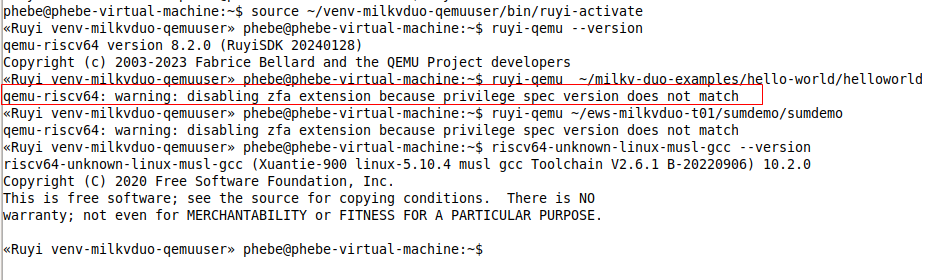

### QEMU模拟器

针对 gnu-milkv-milkv-duo-musl-bin ，暂无配套的qemu模拟器。

1. 下载安装qemu

   ```
   #查询并安装qemu
   ruyi list | grep "qemu"
   ruyi install qemu-user-riscv-upstream
   #ruyi install qemu-system-riscv-upstream

   #创建带qemu的虚拟环境
   ruyi venv -t gnu-milkv-milkv-duo-musl-bin -e qemu-user-riscv-upstream  milkv-duo  venv-milkvduo-qemuuser
   source ~/venv-milkvduo-qemuuser/bin/ruyi-activate 

   ruyi-qemu ~/milkv-duo-examples/hello-world/helloworld
   ruyi-qemu ~/ews-milkvduo-t01/sumdemo/sumdemo
   qemu-riscv64: warning: disabling zfa extension because privilege spec version does not match

   ruyi-deactivate 

   #尝试2：虚拟环境：milkv-duo-musl-bin编译器，换profile generic
   ruyi venv -t gnu-milkv-milkv-duo-musl-bin -e qemu-user-riscv-upstream  generic  venv-milkvduo-generic-qemuuser
   ruyi-qemu ~/milkv-duo-examples/hello-world/helloworld
   ruyi-qemu ~/ews-milkvduo-t01/sumdemo/sumdemo
   #没有任何输出

   #尝试3：虚拟环境：milkv-duo-musl-bin编译器，换qemu版本
   ruyi venv -t gnu-milkv-milkv-duo-musl-bin -e qemu-user-riscv-xthead  milkv-duo  venv-milkvduo-x
   qemu-riscv64: unable to find CPU model 'thead-c906'

   ---------换编译器
   ruyi venv -t gnu-upstream -e qemu-user-riscv-upstream  generic  venv-generic
   #（忘记及时记录，印象是正常输出）

   ```


