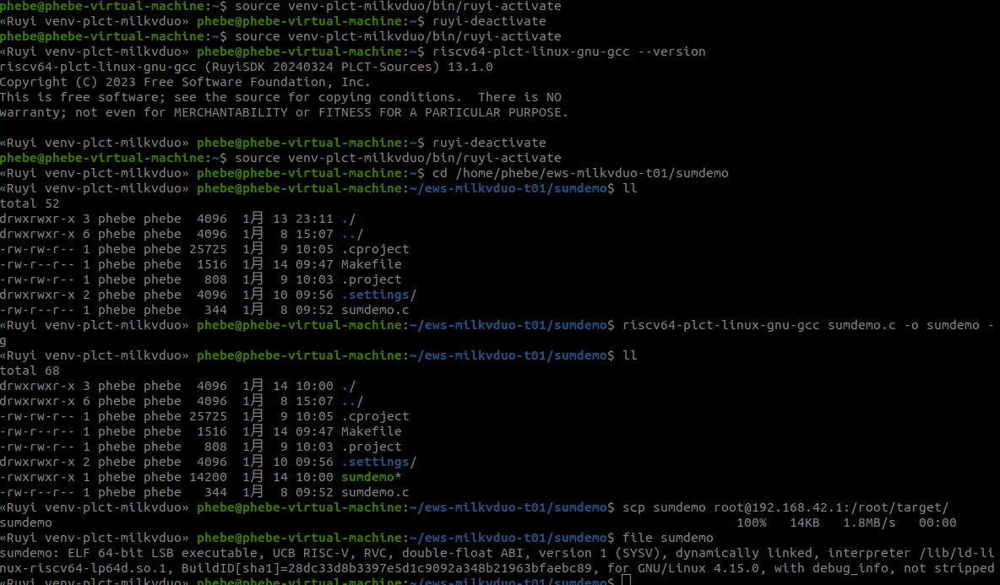
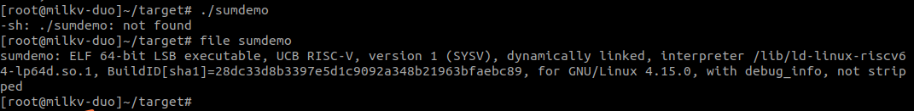

## 使用 gnu-plct 为 milkv duo 编译（验证）

### 调研 gnu-plct 是否能够支持 milkv duo

- milkv duo ：硬件扩展支持情况
- milkv duo ：官方推荐的工具链情况
- 了解 gnu-plct （ 仓库地址：https://github.com/ruyisdk/riscv-gnu-toolchain ）当前指令集支持情况：
  - gnu-plct指令集支持情况历史文档：https://github.com/ruyisdk/docs/blob/f7871dfaf735d84fa61552c10c700afd1b278391/docs/zh/sdk/gnu/index.md

### 安装编译器，编译

2. 安装 gnu-plct 编译器

   ```
   #查看软件源的资源
   #ruyi list

   #安装指定的工具链
   ruyi install gnu-plct
   #从返回信息中可以查看安装的路径，如 ~/.local/share/ruyi/binaries/x86_64/gnu-plct-0.20240324.0
   ```
3. 创建和使用Duo编译环境

   ```
   #查看ruyi预配置环境
   #ruyi list profiles

   #创建一个虚拟环境（自定义命名milkv-venv）：工具链为gnu-plct
   ruyi venv -t gnu-plct milkv-duo ./venv-plct-milkvduo

   #激活虚拟环境
   source venv-plct-milkvduo/bin/ruyi-activate
   ```
4. 编译源码

   ```
   cd sumdemo
   ls -al

   #创建虚拟环境
   source venv-plct-milkvduo/bin/ruyi-activate 

   #查看虚拟环境下的gcc版本
   riscv64-plct-linux-gnu-gcc --version
   riscv64-plct-linux-gnu-gcc (RuyiSDK 20240324 PLCT-Sources) 13.1.0
   Copyright (C) 2023 Free Software Foundation, Inc.
   This is free software; see the source for copying conditions.  There is NO
   warranty; not even for MERCHANTABILITY or FITNESS FOR A PARTICULAR PURPOSE.

   #执行编译
   riscv64-plct-linux-gnu-gcc -g -o sumdemo sumdemo.c  

   #查看
   ls -al
   file sumdemo
   sumdemo: ELF 64-bit LSB executable, UCB RISC-V, RVC, double-float ABI, version 1 (SYSV), dynamically linked, interpreter /lib/ld-linux-riscv64-lp64d.so.1, BuildID[sha1]=28dc33d8b3397e5d1c9092a348b21963bfaebc89, for GNU/Linux 4.15.0, with debug_info, not stripped

   #退出虚拟环境
   ruyi-deactivate 

   #拷贝目标程序到目标设备上
   scp sumdemo root@192.168.42.1:/root/target/

   #在目标设备上运行
   [root@milkv-duo]~/target# ./sumdemo 
   -sh: ./sumdemo: not found
   [root@milkv-duo]~/target# file sumdemo 
   sumdemo: ELF 64-bit LSB executable, UCB RISC-V, version 1 (SYSV), dynamically linked, interpreter /lib/ld-linux-riscv64-lp64d.so.1, BuildID[sha1]=28dc33d8b3397e5d1c9092a348b21963bfaebc89, for GNU/Linux 4.15.0, with debug_info, not stripped

   ```
   

   

   使用 plct-gnu：未能成功运行。

   **结论：与plct gnu小队沟通，目前gnu-plct暂时未支持musl库。**
