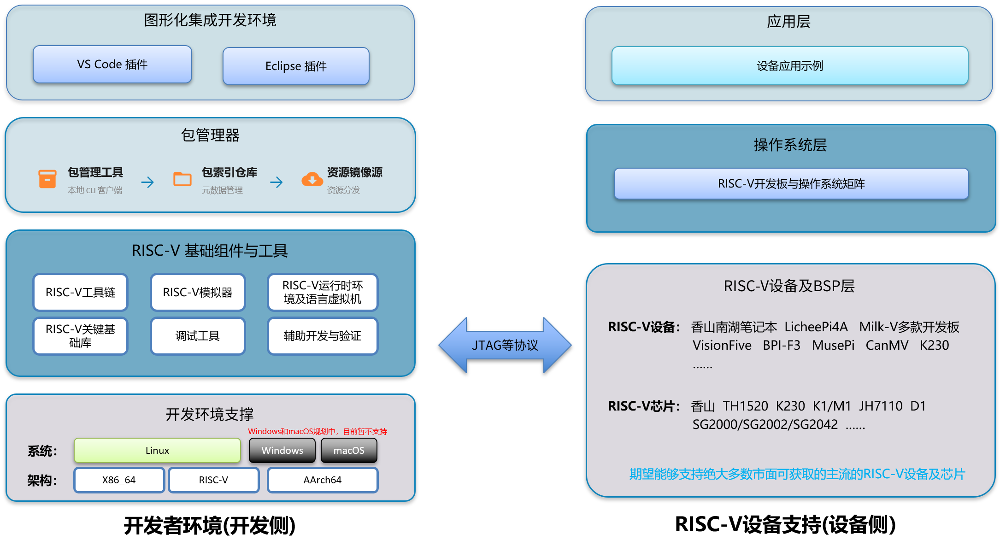

# RuyiSDK 产品总览

> 本文档是 RuyiSDK 的5分钟概要简介，面向初次接触并想要快速了解 RuyiSDK 的朋友。若您想要更深入了解 RuyiSDK 的产生和组成，建议阅读 [产品详情](../intro/product.md)。

RuyiSDK是中国科学院软件研究所主导开发的开源套件，旨在为RISC-V开发者提供一套完整、全栈的开发工具链，涵盖编译、调试、模拟等全流程环节，并兼容主流RISC-V开发板。该套件以 `ruyi` 包管理器为核心，打通从开发、测试到部署的关键环节，向开发者提供一站式服务。

## 一图看懂 RuyiSDK

RuyiSDK 是面向 RISC-V 开发者的“一站式集成开发环境”生态。它不是一个单一软件，而是一个高度集成的产品矩阵，其核心要素包括：

1. 核心包管理器 (`ruyi`)：RuyiSDK 的中枢，统一管理、下载和切换不同版本/厂商的 RISC-V 工具链、模拟器及系统镜像，并通过虚拟环境机制实现多版本隔离与一键切换。**`ruyi` 目前仅支持 Linux 系统（X86_64 / AArch64 / RISC-V 架构）**， **Windows 与 macOS 支持已纳入产品规划**。
2. IDE插件：包括 VS Code 插件和 Eclipse 插件，为不同偏好的开发者提供图形化的 RuyiSDK 能力入口，面向 RISC-V 开发全流程提供直观支持。
3. 基础组件：涵盖 RISC-V 开发所必需的工具链（GNU / LLVM）、模拟器（QEMU）、调试器（GDB / LLDB）及关键运行时（V8、OpenJDK、Go 等）。RuyiSDK 对此进行持续跟踪、优化与适配，确保各组件在 RISC-V 平台上的稳定可用性。
4. 支撑生态：包含软件包索引仓库（定义所有资源的元数据与依赖关系）、硬件与系统支持矩阵（提供开发板与操作系统的兼容性评估），以及设备应用示例库，帮助开发者快速定位所需资源并验证硬件功能。

## 核心能力速览

| 核心能力                       | 关键优势                                                                                                            | 对开发者的价值                                                                           |
| :----------------------------- | :------------------------------------------------------------------------------------------------------------------ | :--------------------------------------------------------------------------------------- |
| **开箱即用的开发环境**   | 一条命令安装完整工具链，内置虚拟环境实现多版本隔离。                                                                | 告别繁琐配置，**5分钟**开始编写第一个RISC-V程序。                                  |
| **全流程工具链覆盖**     | 深度集成编译(GCC/LLVM)、调试(GDB)、模拟(QEMU)工具，均提供可直接安装的二进制包，无需从源码编译。                     | 通过虚拟环境实现多种工具链与依赖组合的**快速搭建与隔离**，满足不同项目的环境需求。 |
| **广泛的硬件与系统生态** | 支持几十种主流RISC-V开发板及多款操作系统，提供硬件支持矩阵；通过 `ruyi device flash` 可一键烧录系统镜像至开发板。 | 快速确认开发板的系统兼容性，降低选型与适配的试错成本。                                   |

## 典型使用场景

| 场景                               | 您的痛点                                                                                      | RuyiSDK 如何帮您                                                                                            |
| :--------------------------------- | :-------------------------------------------------------------------------------------------- | :---------------------------------------------------------------------------------------------------------- |
| **RISC-V 新手快速上手**      | 想赶紧写个 Hello World，却被环境配置卡住。                                                    | 使用 `ruyi` 命令和内置QEMU，**无需开发板**，几分钟完成编译运行。                                    |
| **多款开发板适配**           | 同时为 LicheePi 和 Milk-V Duo 开发，希望使用不同工具链。                                      | 通过 `ruyi venv` 为每个项目创建**隔离的虚拟环境**，互不干扰。                                       |
| **快速尝鲜新工具链版本**     | 想试用某款工具链的最新版本，又不想污染当前开发环境。                                          | 通过 `ruyi install` 安装任意版本的工具链，结合 `ruyi venv` 创建独立环境，**随意尝试，随时删除**。 |
| **避免“手搓”工具链的繁琐** | 开发底层固件或系统软件时，不同项目对GCC版本有不同要求，手动编译安装特定版本的工具链耗时费力。 | `ruyi` 提供**多版本GCC/LLVM预编译二进制包**，直接安装使用，无需自行从源码编译。                     |

## 快速对照

| 你的场景                             | 用什么                                   |
| ------------------------------------ | ---------------------------------------- |
| 安装 RISC-V 工具链                   | `ruyi install`                         |
| 多项目使用不同工具链                 | `ruyi venv`（环境隔离）                |
| 团队环境保持一致                     | 约定统一版本 +`ruyi venv` 环境隔离     |
| 没有实体开发板                       | QEMU 模拟                                |
| 调试开发板上的程序                   | IDE 插件远程调试                         |
| 烧写系统到开发板                     | `ruyi device provision`                |
| 查询板子支持哪些系统                 | 访问支持矩阵                             |
| 在板子上跑点应用示例感受下使用过程   | 访问开发板应用示例                       |
| 在 RISC-V 上运行 Node.js / Java 程序 | 系统包管理器（apt/dnf/pacman）安装运行时 |
| 遇到 RISC-V 或 RuyiSDK 各组件问题    | 技术论坛 / 社群                          |

## 下一步

* **我想了解更多产品定义** → 请阅读 [产品详情](intro/product.md)
* **我想快速体验** → 请阅读 [快速入门](start/qemu.md)
* **我有开发板** → 请阅读 [开发板初体验](start/hw.md)
* **我想了解详细功能** → 请阅读 [产品详细指南](prod/)
* **我想查看硬件支持情况** → 请访问 [支持矩阵](https://matrix.ruyisdk.org)
* **关心RuyiSDK的项目进展** → 请访问 [双周进展报告](https://github.com/ruyisdk/wechat-articles)
* **想要参与贡献** → 请关注[核心仓库](intro/repos.md)和贡献指南
