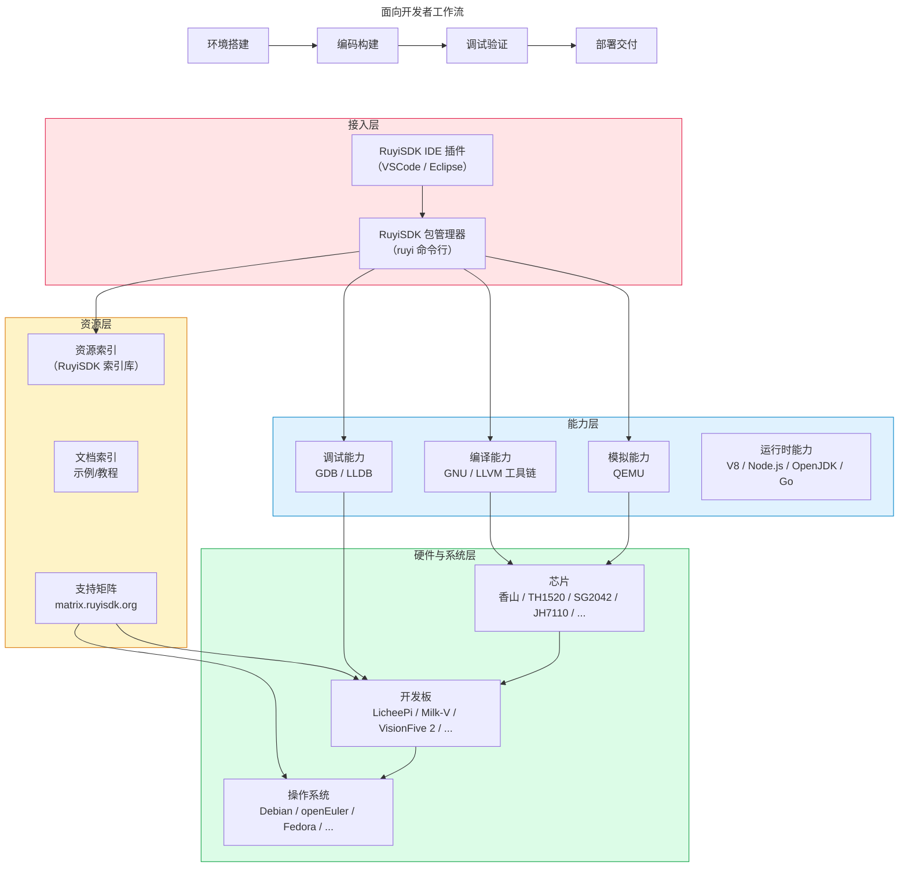

# 产品详细介绍

> 本文档是 RuyiSDK 的详细介绍，面向希望深入了解产品构成与技术架构的开发者。若您首次接触 RuyiSDK，建议先阅读 [产品总览](../intro/overview.md)。

## 产品定义与诞生

### 什么是 RuyiSDK？

RuyiSDK 是中国科学院软件研究所PLCT实验室主导开发的开源套件，致力于为 RISC-V 开发者提供完整、全栈、功能强大的开发工具链，涵盖编译、调试、模拟等全流程支持，并兼容市场上主流 RISC-V 开发板，向 RISC-V 开发者提供一站式服务。

### 诞生背景：为什么 RISC-V 开发需要专属的“工具集”？

近年来，RISC-V 架构凭借其开放与灵活的特性迎来了爆发式增长，各类开发板与处理器层出不穷。然而，**RISC-V 指令集的模块化设计在催生多样化生态的同时，也带来了碎片化问题**。
对于开发者而言，RISC-V 开发往往意味着繁琐的环境拼凑：你需要去不同芯片厂商的官网寻找特定版本的交叉编译器，去开源社区翻找对应的 QEMU 模拟器配置，手动解决 Sysroot 依赖冲突，还要面对各种烧录工具和调试插件的兼容性问题。这种“找工具-配环境-解冲突”的割裂体验，极大地拉高了 RISC-V 的上手门槛。

* **工具链分散**：不同芯片厂商提供各自的编译器版本，版本众多。
* **指令集扩展不统一**：厂商自定义扩展（如玄铁的 `xthead`）与上游主线存在差异，导致同一份代码在不同开发板上可能无法运行。
* **环境配置复杂**：开发者需要手动配置 `-mcpu`、`-march`、`-mabi` 等参数，门槛较高。
* **软硬件信息割裂**：开发板的系统镜像、固件更新、调试资料分散在各处，查找困难。

**RuyiSDK 的诞生正是为了终结这种碎片化现状**——将散落各处的 RISC-V 开发资源标准化、集中化，让开发者不再为环境配置耗费精力。

## 产品目标

RuyiSDK 的核心目标包括：

1. **一站式开发环境**：为 RISC-V 开发者提供完整、全家桶式的全功能开发环境。
2. **广泛的硬件兼容**：支持开发者购买的任何主流 RISC-V 开发板，提供硬件资料、固件更新、调试支持。
3. **透明的底层差异**：通过虚拟环境自动传递编译参数，屏蔽不同 SoC 的指令集差异，让开发者聚焦业务代码。
4. **活跃的开发者社区**：培育运营一个活跃全面的开发者交流社区。

## 产品组成：RuyiSDK 有什么？能做什么？

一句话概括：**一个入口（ruyi 命令行）+ 两种界面（IDE 插件）+ 三张资源地图（索引/支持矩阵/应用示例）+ 四类核心能力（编译/模拟/调试/运行时）+ 广泛的硬件和系统覆盖**

> *注：图中运行时部分表示 RuyiSDK 能力覆盖范围，实际安装分发由系统包管理器完成。*

### 核心流程：全流程开发支持

RuyiSDK 覆盖了从写代码到部署上线的各个关键环节。通过核心的 `ruyi` 包管理器及各 IDE 插件，开发者可以获得以下开箱即用的能力：

* **编译环节**：提供 GCC 与 LLVM 等主流 RISC-V 交叉编译工具链的一键安装，通过内置的虚拟环境机制，支持多环境并存与切换，灵活指定和自定义 Sysroot，轻松实现不同目标板构建环境的隔离，告别繁琐的环境变量配置与依赖冲突。
* **调试环节**：提供开箱即用的远程调试支持，配合 IDE 插件，让在 x86 主机上调试 RISC-V 目标板程序像调试本地程序一样自然。
* **模拟环节**：深度集成 QEMU 等模拟器，即使手头没有实体硬件，开发者也能在本地轻松构建出一个 RISC-V 虚拟运行环境，进行功能验证与测试。
* **部署环节**：打通主流 RISC-V 开发板的镜像下载与烧录流程，只需几条简单命令，即可完成系统的刷写与更新。

### 接入层：你用什么方式使用 RuyiSDK？

| 组件                                           | 功能                               |
| ---------------------------------------------- | ---------------------------------- |
| **RuyiSDK IDE 插件**（VSCode / Eclipse） | 图形化界面，集成编译调试与设备支持 |
| **RuyiSDK 包管理器（`ruyi` 命令）**    | 包管理、虚拟环境、镜像烧写         |

`ruyi` 是 RuyiSDK 的核心枢纽。IDE 插件底层均集成并调用 `ruyi`，统一完成软件包资源的获取、安装及虚拟环境管理等任务。

### 能力层：RuyiSDK 提供哪些开发能力？

| 能力             | 提供者                   | 说明                                                  |
| ---------------- | ------------------------ | ----------------------------------------------------- |
| **编译**   | GNU / LLVM 工具链        | 支持 Profiles RV20/22/23、RVV 1.0、玄铁香山等厂商扩展 |
| **模拟**   | QEMU                     | 无实体硬件时的运行验证                                |
| **调试**   | GDB / LLDB / OpenOCD     | 本地与远程调试                                        |
| **运行时** | V8、Node.js、OpenJDK、Go | 高级语言在 RISC-V 上直接运行                          |

**关于运行时**：OpenJDK、Node.js、Go 等运行时工具，主流 Linux 发行版已通过系统包管理器（如 apt、dnf、pacman）提供了成熟的版本管理方案，支持多版本并存与灵活切换。RuyiSDK 暂不重复提供这类运行时的安装分发能力，专注于解决系统包管理器覆盖不到的开发者痛点（如交叉编译工具链、嵌入式镜像等）。如有相关需求，欢迎向 RuyiSDK 团队反馈，我们将根据社区反响评估后续规划。

### 资源层：RuyiSDK 的软件包资源是怎么管理的？去哪找更多资源？

RuyiSDK 包管理器（`ruyi`）所管理的所有资源，均通过 **RuyiSDK 索引库（packages-index）** 进行统一声明与管理。该索引库是一个公开的配置仓库，定义了每个软件包的名称、版本、来源、依赖关系及哈希校验等信息。`ruyi` 客户端读取该索引后，从对应的软件源下载分发。

除了最核心的索引库之外，RuyiSDK 还提供了以下对开发者比较有帮助的资源：

| 资源                                                                                                    | 说明                                                    |
| ------------------------------------------------------------------------------------------------------- | ------------------------------------------------------- |
| **RuyiSDK 索引库**（[packages-index](https://github.com/ruyisdk/packages-index)）                    | RuyiSDK 资源的统一声明仓库，`ruyi` 工具的核心配置来源 |
| **RuyiSDK 软件源**（[mirror.iscas.ac.cn/ruyisdk/](https://mirror.iscas.ac.cn/ruyisdk/)）             | RuyiSDK 软件包与资源的统一分发站点，提供高速下载        |
| **RISC-V 开发板和操作系统支持矩阵**（[matrix.ruyisdk.org](https://matrix.ruyisdk.org/)）             | 查询某款开发板支持哪些操作系统                          |
| **RuyiSDK 文档**（[ruyisdk.org/docs/intro](https://ruyisdk.org/docs/intro)）                         | 提供 RuyiSDK 产品使用指南                               |
| **RISC-V 开发板应用示例**（[board-docs-frontend.pages.dev](https://board-docs-frontend.pages.dev/)） | 查询某款开发板有哪些应用示例程序部署运行指南            |

### 硬件与系统层：覆盖哪些生态？

从上到下，从用户视角到底层硬件：

- **操作系统**：Debian、Fedora、openEuler、openRuyi、openKylin、OpenCloudOS、deepin、Arch Linux、Gentoo 等
- **开发板**：LicheePi、Milk-V、VisionFive 2、香山笔记本等
- **芯片**：香山、TH1520、SG2042、JH7110、K230 等

> **请注意**：
>
> - **操作系统支持**：RuyiSDK 对各操作系统的支持策略处于动态调整中，具体支持等级请参考《[RuyiSDK 的平台支持情况](https://ruyisdk.org/docs/Other/platform-support)》。
> - **开发板支持**：RuyiSDK 对开发板的支持体现在多个维度，包括工具链适配、系统镜像、调试支持和应用示例等。具体情况可参考资源层的各链接。
> - **芯片支持**：RuyiSDK 对芯片的支持主要体现在编译器（指令集与扩展支持）和模拟器（QEMU 设备模型）两个层面。若需了解某款芯片的编译或模拟支持细节，请查阅相关仓库信息。

## RuyiSDK 组成部分及对照表

| 组件           | 能力                       | 分类             | 获取方式                                                                          |
| -------------- | -------------------------- | ---------------- | --------------------------------------------------------------------------------- |
| GLIBC / newlib | 编译（C 库）               | 基础组件         | `ruyi install gnu-upstream`                                                     |
| GCC            | 编译（编译器）             | 基础组件         | `ruyi install gnu-upstream` / `gnu-plct` / ...                                |
| LLVM / Clang   | 编译（编译器）             | 基础组件         | `ruyi install llvm-upstream` / `llvm-plct` / ...                              |
| QEMU           | 模拟                       | 基础组件         | `ruyi install qemu-user-riscv-upstream` / ...                                   |
| Box64          | 模拟（x86 转译）           | 基础组件         | `ruyi install box64-upstream`                                                   |
| GDB            | 调试                       | 基础组件         | `ruyi install gnu-upstream` / `gnu-plct` / ...                                |
| LLDB           | 调试                       | 基础组件         | `ruyi install llvm-upstream` / `llvm-plct` / ...                              |
| V8             | 运行时（JavaScript引擎）   | 基础组件         | [上游官网](https://chromium.googlesource.com/v8/v8)                                  |
| Node.js        | 运行时（JavaScript）       | 基础组件         | 系统包管理器                                                                      |
| OpenJDK        | 运行时（Java）             | 基础组件         | 系统包管理器                                                                      |
| Go             | 运行时（Go）               | 基础组件         | 系统包管理器                                                                      |
| ruyi           | 包管理、环境管理、镜像烧写 | 自研集成工具     | `pip install ruyi` 或 [下载二进制](https://github.com/ruyisdk/ruyi)                |
| VSCode 插件    | IDE 集成                   | 自研集成工具     | VSCode 插件市场 / Open VSX 搜索 "RuyiSDK"                                         |
| Eclipse 插件   | IDE 集成                   | 自研集成工具     | Eclipse Marketplace 或[更新站点](https://ruyisdk.github.io/ruyisdk-eclipse-plugins/) |
| packages-index | 生态资源（索引）           | 资源层·生态项目 | 随 `ruyi update` 自动使用                                                       |
| support-matrix | 生态资源（支持矩阵）       | 资源层·生态项目 | 访问[matrix.ruyisdk.org](https://matrix.ruyisdk.org)                                 |
| board-docs     | 生态资源（开发板应用示例） | 资源层·生态项目 | 访问[board-docs-frontend.pages.dev](https://board-docs-frontend.pages.dev)           |

> **说明**：
>
> - `gnu-upstream` 跟踪上游主线；`gnu-plct` 作为上游与厂商的桥梁，托管暂未合入上游的厂商扩展，并提供预验证环境。
> - Node.js、OpenJDK、Go 等运行时组件由系统包管理器提供，ruyi 暂不重复分发。
> - V8 已被 Chrome/Chromium 和 Node.js 内置，一般用户无需单独获取。如需将 V8 作为 C++ 库嵌入应用程序，或为 RISC-V 平台交叉编译，请从上游源码构建。
> - VSCode 插件已上架 Visual Studio Marketplace 和 Open VSX Registry，支持 VS Code 及 VSCodium。
> - 上述组件的仓库地址详见 [核心仓库](comm/repos.md)。
