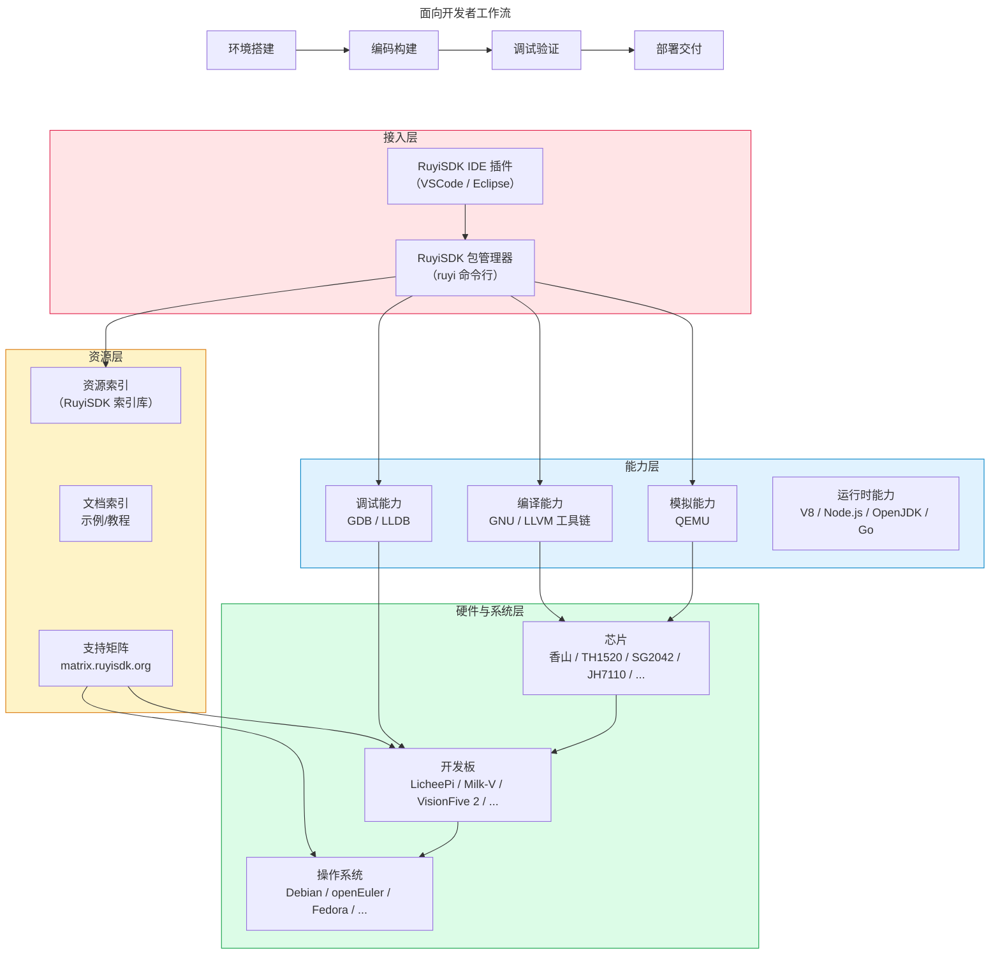

# 1.2 产品组成

## 整体架构

一句话概括：**一个入口（ruyi 命令行）+ 两种界面（IDE 插件）+ 三张资源地图（索引/支持矩阵/应用示例）+ 四类核心能力（编译/模拟/调试/运行时）+ 广泛的硬件和系统覆盖**

> *注：图中运行时部分表示 RuyiSDK 能力覆盖范围，实际安装分发由系统包管理器完成。*

### 接入层：你用什么方式使用 RuyiSDK？

| 组件                                           | 功能                               |
| ---------------------------------------------- | ---------------------------------- |
| **RuyiSDK IDE 插件**（VSCode / Eclipse） | 图形化界面，集成编译调试与设备支持 |
| **RuyiSDK 包管理器（`ruyi` 命令）**    | 包管理、虚拟环境、镜像烧写         |

`ruyi` 是 RuyiSDK 的核心枢纽。IDE 插件底层均集成并调用 `ruyi`，统一完成软件包资源的获取、安装及虚拟环境管理等任务。

### 能力层：RuyiSDK 提供哪些开发能力？

| 能力             | 提供者                   | 说明                                                  |
| ---------------- | ------------------------ | ----------------------------------------------------- |
| **编译**   | GNU / LLVM 工具链        | 支持 Profiles RV20/22/23、RVV 1.0、玄铁香山等厂商扩展 |
| **模拟**   | QEMU                     | 无实体硬件时的运行验证                                |
| **调试**   | GDB / LLDB + 性能工具    | 本地与远程调试一体化                                  |
| **运行时** | V8、Node.js、OpenJDK、Go | 高级语言在 RISC-V 上直接运行                          |

**关于运行时**：OpenJDK、Node.js、Go 等运行时工具，主流 Linux 发行版已通过系统包管理器（如 apt、dnf、pacman）提供了成熟的版本管理方案，支持多版本并存与灵活切换。RuyiSDK 暂不重复提供这类运行时的安装分发能力，专注于解决系统包管理器覆盖不到的开发者痛点（如交叉编译工具链、嵌入式镜像等）。如有相关需求，欢迎向 RuyiSDK 团队反馈，我们将根据社区反响评估后续规划。

### 资源层：RuyiSDK 的软件包资源是怎么管理的？去哪找更多资源？

RuyiSDK 包管理器（`ruyi`）所管理的所有资源，均通过 **RuyiSDK 索引库（packages-index）** 进行统一声明与管理。该索引库是一个公开的配置仓库，定义了每个软件包的名称、版本、来源、依赖关系及哈希校验等信息。`ruyi` 客户端读取该索引后，从对应的软件源下载分发。

除了最核心的索引库之外，RuyiSDK 还提供了以下对开发者比较有帮助的资源：

| 资源                                                                                                    | 说明                                                    |
| ------------------------------------------------------------------------------------------------------- | ------------------------------------------------------- |
| **RuyiSDK 索引库**（[packages-index](https://github.com/ruyisdk/packages-index)）                    | RuyiSDK 资源的统一声明仓库，`ruyi` 工具的核心配置来源 |
| **RuyiSDK 软件源**（[mirror.iscas.ac.cn/ruyisdk/](https://mirror.iscas.ac.cn/ruyisdk/)）             | RuyiSDK 软件包与资源的统一分发站点，提供高速下载        |
| **RISC-V 开发板和操作系统支持矩阵**（[matrix.ruyisdk.org](https://matrix.ruyisdk.org/)）             | 查询某款开发板支持哪些操作系统                          |
| **RuyiSDK 文档**（[ruyisdk.org/docs/intro](https://ruyisdk.org/docs/intro)）                         | 提供 RuyiSDK 产品使用指南                               |
| **RISC-V 开发板应用示例**（[board-docs-frontend.pages.dev](https://board-docs-frontend.pages.dev/)） | 查询某款开发板有哪些应用示例程序部署运行指南            |

### 硬件与系统层：覆盖哪些生态？

从上到下，从用户视角到底层硬件：

- **操作系统**：Debian、Fedora、openEuler、openRuyi、openKylin、OpenCloudOS、deepin、Arch Linux、Gentoo 等
- **开发板**：LicheePi、Milk-V、VisionFive 2、香山笔记本等
- **芯片**：香山、TH1520、SG2042、JH7110、K230 等

> **请注意**：
>
> - **操作系统支持**：RuyiSDK 对各操作系统的支持策略处于动态调整中，具体支持等级请参考《[RuyiSDK 的平台支持情况](https://ruyisdk.org/docs/Other/platform-support)》。
> - **开发板支持**：RuyiSDK 对开发板的支持体现在多个维度，包括工具链适配、系统镜像、调试支持和应用示例等。具体情况可参考资源层的各链接。
> - **芯片支持**：RuyiSDK 对芯片的支持主要体现在编译器（指令集与扩展支持）和模拟器（QEMU 设备模型）两个层面。若需了解某款芯片的编译或模拟支持细节，请查阅相关仓库信息。

---

## RuyiSDK 组成部分及对照表

| 组件           | 能力                       | 分类             | 获取方式                                                                          |
| -------------- | -------------------------- | ---------------- | --------------------------------------------------------------------------------- |
| GLIBC / newlib | 编译（C 库）               | 基础组件         | `ruyi install gnu-upstream`                                                     |
| GCC            | 编译（编译器）             | 基础组件         | `ruyi install gnu-upstream` / `gnu-plct` / ...                                |
| LLVM / Clang   | 编译（编译器）             | 基础组件         | `ruyi install llvm-upstream` / `llvm-plct` / ...                              |
| QEMU           | 模拟                       | 基础组件         | `ruyi install qemu-user-riscv-upstream` / ...                                   |
| Box64          | 模拟（x86 转译）           | 基础组件         | `ruyi install box64-upstream`                                                   |
| GDB            | 调试                       | 基础组件         | `ruyi install gnu-upstream` / `gnu-plct` / ...                                |
| LLDB           | 调试                       | 基础组件         | `ruyi install llvm-upstream` / `llvm-plct` / ...                              |
| V8             | 运行时（JavaScript引擎）   | 基础组件         | [上游官网](https://chromium.googlesource.com/v8/v8)                                  |
| Node.js        | 运行时（JavaScript）       | 基础组件         | 系统包管理器                                                                      |
| OpenJDK        | 运行时（Java）             | 基础组件         | 系统包管理器                                                                      |
| Go             | 运行时（Go）               | 基础组件         | 系统包管理器                                                                      |
| ruyi           | 包管理、环境管理、镜像烧写 | 自研集成工具     | `pip install ruyi` 或 [下载二进制](https://github.com/ruyisdk/ruyi)                |
| VSCode 插件    | IDE 集成                   | 自研集成工具     | VSCode 插件市场 / Open VSX 搜索 "RuyiSDK"                                         |
| Eclipse 插件   | IDE 集成                   | 自研集成工具     | Eclipse Marketplace 或[更新站点](https://ruyisdk.github.io/ruyisdk-eclipse-plugins/) |
| packages-index | 生态资源（索引）           | 资源层·生态项目 | 随 `ruyi update` 自动使用                                                       |
| support-matrix | 生态资源（支持矩阵）       | 资源层·生态项目 | 访问[matrix.ruyisdk.org](https://matrix.ruyisdk.org)                                 |
| board-docs     | 生态资源（开发板应用示例） | 资源层·生态项目 | 访问[board-docs-frontend.pages.dev](https://board-docs-frontend.pages.dev)           |

> **说明**：
>
> - `gnu-upstream` 跟踪上游主线；`gnu-plct` 作为上游与厂商的桥梁，托管暂未合入上游的厂商扩展，并提供预验证环境。
> - Node.js、OpenJDK、Go 等运行时组件由系统包管理器提供，ruyi 暂不重复分发。
> - V8 已被 Chrome/Chromium 和 Node.js 内置，一般用户无需单独获取。如需将 V8 作为 C++ 库嵌入应用程序，或为 RISC-V 平台交叉编译，请从上游源码构建。
> - VSCode 插件已上架 **Visual Studio Marketplace** 和 **Open VSX Registry**，支持 VS Code 及 VSCodium。
> - 上述组件的仓库地址详见 [8.2 核心仓库与 Maintainer](comm/repos.md)。

## 社区与生态

RuyiSDK 不仅是工具，也是一个开放的开发者社区。无论是使用问题、技术探讨，还是希望参与贡献，都可以通过以下渠道找到我们：

- **技术论坛**（[ruyisdk.cn](https://ruyisdk.cn/)）：技术讨论与问题答疑
- **开源协作**（[github.com/ruyisdk](https://github.com/ruyisdk)）：GitHub 托管，欢迎贡献
- **即时社群**（[社群二维码](https://ruyisdk.org/about)）：微信群、QQ 群

## 快速对照

| 你的场景                             | 用什么                                   |
| ------------------------------------ | ---------------------------------------- |
| 安装 RISC-V 工具链                   | `ruyi install`                         |
| 多项目使用不同工具链                 | `ruyi venv`（环境隔离）                |
| 团队环境保持一致                     | 约定统一版本 +`ruyi venv` 环境隔离     |
| 没有实体开发板                       | QEMU 模拟                                |
| 调试开发板上的程序                   | IDE 插件远程调试                         |
| 烧写系统到开发板                     | `ruyi device provision`                |
| 查询板子支持哪些系统                 | 访问支持矩阵                             |
| 在 RISC-V 上运行 Node.js / Java 程序 | 系统包管理器（apt/dnf/pacman）安装运行时 |
| 遇到 RISC-V 或 RuyiSDK 各组件问题    | 技术论坛 / 社群                          |
